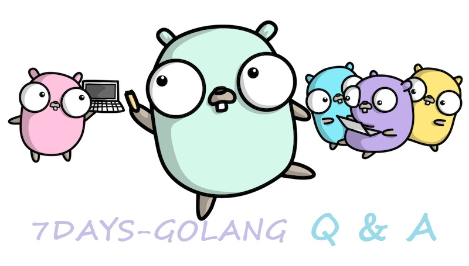

## The Problem

In the article [Implement a Distributed Cache in Go - GeeCache Day 2 Single-Node Concurrent Cache](https://geektutu.com/post/geecache-day2.html), there is an implementation of an interface-based function:

```go
// A Getter loads data for a key.
type Getter interface {
	Get(key string) ([]byte, error)
}

// A GetterFunc implements Getter with a function.
type GetterFunc func(key string) ([]byte, error)

// Get implements Getter interface function
func (f GetterFunc) Get(key string) ([]byte, error) {
	return f(key)
}
```

Here, an interface `Getter` is defined, containing only a single method `Get(key string) ([]byte, error)`. Right after that, a function type `GetterFunc` is defined, whose parameters and return values are identical to those of the Get method in Getter. Moreover, GetterFunc also defines a Get method, and within that Get method it calls itself, which makes GetterFunc implement the Getter interface. So GetterFunc is a function type that implements an interface, or in short, an interface-based function.

This implementation of the interface-based function caught the attention of several readers. Interface-based functions only apply when the interface defines a single method — for example, the Getter interface has exactly one method, Get. Since there is only one method, why go to the extra trouble of wrapping it in an interface? Wouldn't it be simpler to just use the function type GetterFunc directly when defining the parameter, letting users pass in a function as the argument?

So, what is the value of interface-based functions?


## The Value

Let's imagine a usage scenario in which `GetFromSource` retrieves results from some data source, and the interface type Getter is one of its parameters, representing that data source:

```go
func GetFromSource(getter Getter, key string) []byte {
	buf, err := getter.Get(key)
	if err == nil {
		return buf
	}
	return nil
}
```

We can call this function in several ways:

- Option 1: pass a function of type GetterFunc as the parameter

```go
GetFromSource(GetterFunc(func(key string) ([]byte, error) {
	return []byte(key), nil
}), "hello")
```

Anonymous functions are supported, and so are ordinary functions:

```go
func test(key string) ([]byte, error) {
	return []byte(key), nil
}

func main() {
    GetFromSource(GetterFunc(test), "hello")
}
```

Here, test is type-converted to GetterFunc. Since GetterFunc implements the Getter interface, it is a valid argument. This approach suits scenarios with relatively simple logic.


- Option 2: pass a struct that implements the Getter interface as the parameter

```go
type DB struct{ url string}

func (db *DB) Query(sql string, args ...string) string {
	// ...
	return "hello"
}

func (db *DB) Get(key string) ([]byte, error) {
	// ...
	v := db.Query("SELECT NAME FROM TABLE WHEN NAME= ?", key)
	return []byte(v), nil
}

func main() {
	GetFromSource(new(DB), "hello")
}
```

DB implements the Getter interface, so it is also a valid argument. This approach suits scenarios with more complex logic — for example, when operating on a database requires a lot of information such as the address, username, and password, along with intermediate state that must be maintained, such as timeouts, reconnections, and locking. In such cases, it is more appropriate to wrap everything in a struct and pass it as a parameter.

This way, an ordinary function type (with a type conversion) can be passed as a parameter, and so can a struct. It is more flexible to use and more readable — that is the value of interface-based functions.

## Where It Is Used

This feature is widely used in many open-source Go projects such as groupcache, and it appears frequently in the standard library as well — the `Handler` and `HandlerFunc` pair in `net/http` is a typical example.

Let's first look at the definition of Handler:

```go
type Handler interface {
	ServeHTTP(ResponseWriter, *Request)
}
type HandlerFunc func(ResponseWriter, *Request)

func (f HandlerFunc) ServeHTTP(w ResponseWriter, r *Request) {
	f(w, r)
}
```

> Excerpted from the Go source code, [net/http/server.go](https://github.com/golang/go/blob/master/src/net/http/server.go)

We can use `http.Handle` to map request paths to handlers; Handle is defined as follows:

```go
func Handle(pattern string, handler Handler)
```

The second parameter is the interface type Handler, and we can use it like this:

```go
func home(w http.ResponseWriter, r *http.Request) {
	w.WriteHeader(http.StatusOK)
	_, _ = w.Write([]byte("hello, index page"))
}

func main() {
	http.Handle("/home", http.HandlerFunc(home))
	_ = http.ListenAndServe("localhost:8000", nil)
}
```

Usually, we also use another function, `http.HandleFunc`, which is defined as follows:

```go
func HandleFunc(pattern string, handler func(ResponseWriter, *Request))
```

The second parameter here is an ordinary function type, so we can pass home directly to HandleFunc:

```go
func main() {
	http.HandleFunc("/home", home)
	_ = http.ListenAndServe("localhost:8000", nil)
}
```

If we look at the internal implementation of HandleFunc, we will find that the two forms are completely equivalent — internally, the second form is converted into the first.

```go
func (mux *ServeMux) HandleFunc(pattern string, handler func(ResponseWriter, *Request)) {
	if handler == nil {
		panic("http: nil handler")
	}
	mux.Handle(pattern, HandlerFunc(handler))
}
```

If you look closely, you will notice that the second parameter of `http.ListenAndServe` is also the interface type `Handler`. Since we are using the router built into the standard library `net/http`, we pass in nil. But what if we pass in a struct that implements the `Handler` interface instead? Then we could take full control of all HTTP requests — how routing is done, how requests are processed, and what extra functionality is added before and after a request can all be customized. Gradually, this turns into a full-featured Web framework. If you are interested, you can read [7 Days to Build a Web Framework in Go from Scratch - Gee](https://geektutu.com/post/gee.html).

## Similar Features in Other Languages

Those with Java programming experience may find this especially familiar. Java 1.5 did not support passing functions directly; parameters had to be either interfaces or objects. The simplest example is custom sorting of a list, which required implementing an anonymous Comparator class and overriding the compare method.

```java
Collections.sort(list, new Comparator<Integer>(){
    @Override
    public int compare(Integer o1, Integer o2) {
        return o2 - o1;
    }
});
```

Java 1.8 introduced many functional programming features, among which lambda expressions and functional interfaces are a great way to simplify Java code. In Java 1.8, the example above can be simplified to:

```java
Collections.sort(list, (Integer o1, Integer o2) -> o2 - o1 );
```

That is, constructing an anonymous object is simplified into writing just a lambda function expression, which can be seen as a combination of object-oriented and functional programming. Likewise, this form only supports interface types that define a single method. It is precisely this combination that achieves the same behavior with less code.

## Appendix: References

- [Summary of valuable issue discussions in 7days-golang](https://github.com/geektutu/7days-golang/issues/24)
- [GeeCache Day 2 Single-Node Concurrent Cache - GitHub Comments](https://github.com/geektutu/blog/issues/64)
