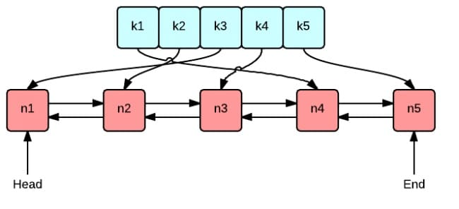

This article is part of the [7 Days Go Distributed Cache Tutorial Series from scratch](https://geektutu.com/post/geecache.html).

- Introduces the three most common cache eviction (expiry) algorithms: FIFO, LFU, and LRU
- Implements the LRU cache eviction algorithm, **about 80 lines of code**

## 1 Introduction to FIFO/LFU/LRU Algorithms

GeeCache stores all of its cache entries in memory, and memory is limited, so data cannot be added without bound. Suppose we set the maximum memory available to the cache to N. Then at some point, after adding a cache entry, the memory usage exceeds N, and we need to remove one or more entries from the cache. Which ones should we remove? We certainly want to remove the "useless" data as much as possible. But how do we decide whether data is "useful" or "useless"?

### 1.1 FIFO(First In First Out)

First in, first out: evict the oldest (earliest added) record in the cache. FIFO assumes that an entry added early is more likely to no longer be in use than one that was just added. This algorithm is also very simple to implement: create a queue, append new records to the tail, and evict the head whenever memory runs out. However, in many scenarios, some records, although added early, are also accessed most frequently, yet they inevitably get evicted simply because they have been sitting in the cache for too long. This kind of data gets added to the cache frequently and then evicted, reducing the cache hit rate.

### 1.2 LFU(Least Frequently Used)

Least frequently used: evict the record with the lowest access frequency in the cache. LFU assumes that if data has been accessed many times in the past, it will be accessed more frequently in the future. Implementing LFU requires maintaining a queue sorted by access count; on each access, the count is incremented and the queue is re-sorted, and on eviction, the entry with the fewest accesses is chosen. The LFU algorithm has a fairly high hit rate, but its drawbacks are obvious: maintaining the access count of every record consumes a lot of memory. In addition, if the data access pattern changes, LFU takes a relatively long time to adapt—in other words, the LFU algorithm is heavily influenced by historical data. For example, if a piece of data had an extremely high access count historically but is hardly accessed anymore after a certain point in time, it still cannot be evicted for a long time because of its historically high access count.

### 1.3 LRU(Least Recently Used) 

Least recently used: compared with FIFO, which only considers time, and LFU, which only considers access frequency, LRU can be considered a relatively balanced eviction algorithm. LRU assumes that if data has been accessed recently, it is more likely to be accessed again in the future. The LRU algorithm is very simple to implement: maintain a queue, and when a record is accessed, move it to the tail of the queue. The head of the queue is then the least recently accessed data, and evicting that record suffices.

## 2 Implementing the LRU Algorithm

### 2.1 Core Data Structures



This diagram nicely illustrates the 2 core data structures of the LRU algorithm:

- The green one is a dictionary (map), which stores the mapping between keys and values. This way, looking up the corresponding value for a key has a complexity of `O(1)`, and inserting a record into the dictionary is also `O(1)`.
- The red one is a queue implemented with a doubly linked list. Put all the values into the doubly linked list, so that when a value is accessed, moving it to the tail has a complexity of `O(1)`, and both adding a record at the tail and deleting a record are `O(1)`.

Next, we create a struct type `Cache` that contains the dictionary and the doubly linked list, making the subsequent add/remove/lookup/update operations easier to implement.

[day1-lru/geecache/lru/lru.go - github](https://github.com/geektutu/7days-golang/tree/master/gee-cache/day1-lru/geecache/lru)

```go
package lru

import "container/list"

// Cache is a LRU cache. It is not safe for concurrent access.
type Cache struct {
	maxBytes int64
	nbytes   int64
	ll       *list.List
	cache    map[string]*list.Element
	// optional and executed when an entry is purged.
	OnEvicted func(key string, value Value)
}

type entry struct {
	key   string
	value Value
}

// Value use Len to count how many bytes it takes
type Value interface {
	Len() int
}
```

- Here we directly use the doubly linked list `list.List` from the Go standard library.
- The dictionary is defined as `map[string]*list.Element`, where the key is a string and the value is a pointer to the corresponding node in the doubly linked list.
- `maxBytes` is the maximum memory allowed, `nbytes` is the memory currently in use, and `OnEvicted` is a callback function invoked when a record is removed; it may be nil.
- The key-value pair `entry` is the data type of the doubly linked list node. The benefit of still keeping each value's key in the list is that when the head node is evicted, the key is needed to delete the corresponding mapping from the dictionary.
- For generality, we allow the value to be of any type that implements the `Value` interface. This interface contains only one method, `Len() int`, which returns the amount of memory the value occupies.


To make it easy to instantiate `Cache`, we implement the `New()` function:

```go
// New is the Constructor of Cache
func New(maxBytes int64, onEvicted func(string, Value)) *Cache {
	return &Cache{
		maxBytes:  maxBytes,
		ll:        list.New(),
		cache:     make(map[string]*list.Element),
		OnEvicted: onEvicted,
	}
}
```

### 2.2 Lookup

Lookup consists of 2 main steps: the first step is to find the corresponding node in the doubly linked list via the dictionary; the second step is to move that node to the tail of the queue.

```go
// Get look ups a key's value
func (c *Cache) Get(key string) (value Value, ok bool) {
	if ele, ok := c.cache[key]; ok {
		c.ll.MoveToFront(ele)
		kv := ele.Value.(*entry)
		return kv.value, true
	}
	return
}
```

- If the list node for the key exists, move the node to the tail of the queue and return the found value.
- `c.ll.MoveToFront(ele)`, i.e., move the node `ele` in the list to the tail (with a doubly linked list as a queue, the head and tail are relative; here we define front as the tail of the queue).

### 2.3 Deletion

The deletion here is actually cache eviction, i.e., removing the least recently accessed node (the head of the queue).

```go
// RemoveOldest removes the oldest item
func (c *Cache) RemoveOldest() {
	ele := c.ll.Back()
	if ele != nil {
		c.ll.Remove(ele)
		kv := ele.Value.(*entry)
		delete(c.cache, kv.key)
		c.nbytes -= int64(len(kv.key)) + int64(kv.value.Len())
		if c.OnEvicted != nil {
			c.OnEvicted(kv.key, kv.value)
		}
	}
}
```

- `c.ll.Back()` retrieves the head node and removes it from the list.
- `delete(c.cache, kv.key)`, removes the mapping for this node from the dictionary `c.cache`.
- Update the memory currently in use, `c.nbytes`.
- If the callback function `OnEvicted` is not nil, invoke the callback.

### 2.4 Add/Update

```go
// Add adds a value to the cache.
func (c *Cache) Add(key string, value Value) {
	if ele, ok := c.cache[key]; ok {
		c.ll.MoveToFront(ele)
		kv := ele.Value.(*entry)
		c.nbytes += int64(value.Len()) - int64(kv.value.Len())
		kv.value = value
	} else {
		ele := c.ll.PushFront(&entry{key, value})
		c.cache[key] = ele
		c.nbytes += int64(len(key)) + int64(value.Len())
	}
	for c.maxBytes != 0 && c.maxBytes < c.nbytes {
		c.RemoveOldest()
	}
}
```

- If the key exists, update the value of the corresponding node and move the node to the tail.
- If the key does not exist, this is an insertion scenario: first add a new node at the tail `&entry{key, value}`, and add the mapping from key to node in the dictionary.
- Update `c.nbytes`; if it exceeds the configured maximum `c.maxBytes`, evict the least recently accessed node.

Finally, to make testing easier, we implement `Len()` to get how many entries have been added.

```go
// Len the number of cache entries
func (c *Cache) Len() int {
	return c.ll.Len()
}
```

## 3 Testing

For example, we can try adding a few entries and test the `Get` method:

[day1-lru/geecache/lru/lru_test.go - github](https://github.com/geektutu/7days-golang/tree/master/gee-cache/day1-lru/geecache/lru)

```go
type String string

func (d String) Len() int {
	return len(d)
}

func TestGet(t *testing.T) {
	lru := New(int64(0), nil)
	lru.Add("key1", String("1234"))
	if v, ok := lru.Get("key1"); !ok || string(v.(String)) != "1234" {
		t.Fatalf("cache hit key1=1234 failed")
	}
	if _, ok := lru.Get("key2"); ok {
		t.Fatalf("cache miss key2 failed")
	}
}
```

Test whether the eviction of "useless" nodes is triggered when memory usage exceeds the configured limit:

```go
func TestRemoveoldest(t *testing.T) {
	k1, k2, k3 := "key1", "key2", "k3"
	v1, v2, v3 := "value1", "value2", "v3"
	cap := len(k1 + k2 + v1 + v2)
	lru := New(int64(cap), nil)
	lru.Add(k1, String(v1))
	lru.Add(k2, String(v2))
	lru.Add(k3, String(v3))

	if _, ok := lru.Get("key1"); ok || lru.Len() != 2 {
		t.Fatalf("Removeoldest key1 failed")
	}
}
```

Test whether the callback function gets invoked:

```go
func TestOnEvicted(t *testing.T) {
	keys := make([]string, 0)
	callback := func(key string, value Value) {
		keys = append(keys, key)
	}
	lru := New(int64(10), callback)
	lru.Add("key1", String("123456"))
	lru.Add("k2", String("k2"))
	lru.Add("k3", String("k3"))
	lru.Add("k4", String("k4"))

	expect := []string{"key1", "k2"}

	if !reflect.DeepEqual(expect, keys) {
		t.Fatalf("Call OnEvicted failed, expect keys equals to %s", expect)
	}
}
```

## Further Reading

- [A Concise Go Tutorial](https://geektutu.com/post/quick-golang.html)
- [A Concise Go Test Unit Testing Tutorial](https://geektutu.com/post/quick-go-test.html)
- [Official list Documentation - golang.org](https://golang.org/pkg/container/list/)
