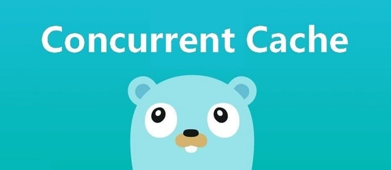

This article is the second part of the [7 Days Go Distributed Cache from scratch](https://geektutu.com/post/geecache.html) series.

- Introduces the use of the sync.Mutex mutual exclusion lock, and implements concurrency control for the LRU cache.
- Implements GeeCache's core data structure Group; when the cache misses, a callback function is invoked to fetch the source data, **about 150 lines of code**

## 1 sync.Mutex

When multiple goroutines read and write the same variable at the same time, conflicts occur under high concurrency. Ensuring that only one goroutine can access the variable at a time to avoid conflicts is called `mutual exclusion`, and a mutual exclusion lock (mutex) can solve this problem.

> sync.Mutex is a mutual exclusion lock that can be locked and unlocked by different goroutines.

`sync.Mutex` is a mutual exclusion lock provided by the Go standard library. Once a goroutine acquires ownership of the lock, other goroutines requesting the lock block on the call to the `Lock()` method until the lock is released by calling `Unlock()`.

Let's look at a simple example. Suppose 10 concurrent goroutines print the same number `100`. To avoid printing it repeatedly, we implement the `printOnce(num int)` function, which uses a set to record the numbers that have already been printed; if a number has already been printed, it is not printed again.

```go
var set = make(map[int]bool, 0)

func printOnce(num int) {
	if _, exist := set[num]; !exist {
		fmt.Println(num)
	}
	set[num] = true
}

func main() {
	for i := 0; i < 10; i++ {
		go printOnce(100)
	}
	time.Sleep(time.Second)
}
```

What happens if we run `go run .`?

```bash
$ go run .
100
100
```

Sometimes it prints 2 times, sometimes 4 times, and sometimes it even triggers a panic, because accesses to the same data structure `set` conflict. Next, we use the mutex's `Lock()` and `Unlock()` methods to wrap the conflicting parts:

```go
var m sync.Mutex
var set = make(map[int]bool, 0)

func printOnce(num int) {
	m.Lock()
	if _, exist := set[num]; !exist {
		fmt.Println(num)
	}
	set[num] = true
	m.Unlock()
}

func main() {
	for i := 0; i < 10; i++ {
		go printOnce(100)
	}
	time.Sleep(time.Second)
}
```

```bash
$ go run .
100
```

Now the same number is printed only once. When one goroutine calls the `Lock()` method, the other goroutines are blocked until `Unlock()` is called and the lock is released. Therefore the wrapped code can avoid conflicts and achieve mutual exclusion.

There is another way to write the release of the lock with `Unlock()`:

```go
func printOnce(num int) {
	m.Lock()
	defer m.Unlock()
	if _, exist := set[num]; !exist {
		fmt.Println(num)
	}
	set[num] = true
}
```

## 2 Supporting Concurrent Reads and Writes

The previous article, [GeeCache Day 1](https://geektutu.com/post/geecache-day1.html), implemented the LRU cache eviction strategy. Next, we use `sync.Mutex` to wrap several methods of LRU so that it supports concurrent reads and writes. Before that, we abstract a read-only data structure `ByteView` to represent the cached value; it is one of GeeCache's main data structures.

[day2-single-node/geecache/byteview.go - github](https://github.com/geektutu/7days-golang/tree/master/gee-cache/day2-single-node/geecache)

```go
package geecache

// A ByteView holds an immutable view of bytes.
type ByteView struct {
	b []byte
}

// Len returns the view's length
func (v ByteView) Len() int {
	return len(v.b)
}

// ByteSlice returns a copy of the data as a byte slice.
func (v ByteView) ByteSlice() []byte {
	return cloneBytes(v.b)
}

// String returns the data as a string, making a copy if necessary.
func (v ByteView) String() string {
	return string(v.b)
}

func cloneBytes(b []byte) []byte {
	c := make([]byte, len(b))
	copy(c, b)
	return c
}
```

- ByteView has only one data member, `b []byte`, where b stores the actual cached value. The byte type was chosen so that storage of any data type is supported, such as strings, images, and so on.
- We implement the `Len() int` method because in our lru.Cache implementation, cached objects are required to implement the Value interface, i.e., the `Len() int` method, which returns the size of the memory they occupy.
- `b` is read-only, and the `ByteSlice()` method returns a copy to prevent the cached value from being modified by external programs.

Now we can add concurrency support to lru.Cache.

[day2-single-node/geecache/cache.go - github](https://github.com/geektutu/7days-golang/tree/master/gee-cache/day2-single-node/geecache)

```go
package geecache

import (
	"geecache/lru"
	"sync"
)

type cache struct {
	mu         sync.Mutex
	lru        *lru.Cache
	cacheBytes int64
}

func (c *cache) add(key string, value ByteView) {
	c.mu.Lock()
	defer c.mu.Unlock()
	if c.lru == nil {
		c.lru = lru.New(c.cacheBytes, nil)
	}
	c.lru.Add(key, value)
}

func (c *cache) get(key string) (value ByteView, ok bool) {
	c.mu.Lock()
	defer c.mu.Unlock()
	if c.lru == nil {
		return
	}

	if v, ok := c.lru.Get(key); ok {
		return v.(ByteView), ok
	}

	return
}
```

- The implementation of `cache.go` is quite simple: instantiate lru, wrap the get and add methods, and add the mutex mu.
- In the `add` method, we check whether `c.lru` is nil, and only create the instance if it equals nil. This approach is called Lazy Initialization: lazy initialization of an object means that the object's creation is deferred until the first time the object is used. It is mainly used to improve performance and reduce a program's memory requirements.

## 3 The Main Structure: Group

Group is GeeCache's most core data structure, responsible for interacting with users and controlling the flow of storing and retrieving cached values.

```bash
                          yes
receive key --> check if cached -----> return cached value ⑴
                |  no                              yes
                |-----> should it be fetched from a remote node? -----> interact with the remote node --> return cached value ⑵
                            |  no
                            |-----> call the `callback function`, get the value and add it to the cache --> return cached value ⑶
```

We will implement the main structure Group in `geecache.go`, at which point the skeleton of GeeCache's code structure takes shape.

```bash
geecache/
    |--lru/
        |--lru.go  // lru cache eviction strategy
    |--byteview.go // abstraction and encapsulation of the cached value
    |--cache.go    // concurrency control
    |--geecache.go // interacts with the outside, controlling the main flow of cache storage and retrieval
```

Next, we will implement flows ⑴ and ⑶; the part that interacts with remote nodes will be implemented later.


### 3.1 The Getter Callback

Let's think about it: if the cache does not exist, data should be fetched from the data source (files, databases, etc.) and added to the cache. Should GeeCache support configuring multiple kinds of data sources? It should not. First, there are too many kinds of data sources to implement them all; second, extensibility would be poor. How to fetch data from the source should be the user's decision, so let's hand this over to the user. Therefore, we design a callback function that is invoked when the cache does not exist, to obtain the source data.

[day2-single-node/geecache/geecache.go - github](https://github.com/geektutu/7days-golang/tree/master/gee-cache/day2-single-node/geecache)

```go
// A Getter loads data for a key.
type Getter interface {
	Get(key string) ([]byte, error)
}

// A GetterFunc implements Getter with a function.
type GetterFunc func(key string) ([]byte, error)

// Get implements Getter interface function
func (f GetterFunc) Get(key string) ([]byte, error) {
	return f(key)
}
```

- Define the Getter interface and the callback function `Get(key string)([]byte, error)`, which takes a key as the parameter and returns []byte.
- Define the function type GetterFunc and implement the `Get` method of the Getter interface.
- Implementing an interface with a function type is called an interface-type function. It makes it convenient for users to pass either a function as an argument or a struct that implements the interface as an argument.

> To learn about the use cases of interface-type functions, see [Use Cases of Go Interface-Type Functions - 7days-golang Q & A](https://geektutu.com/post/7days-golang-q1.html)

We can write a test case to ensure the callback function works correctly.

```go
func TestGetter(t *testing.T) {
	var f Getter = GetterFunc(func(key string) ([]byte, error) {
		return []byte(key), nil
	})

	expect := []byte("key")
	if v, _ := f.Get("key"); !reflect.DeepEqual(v, expect) {
		t.Errorf("callback failed")
	}
}
```

- In this test case, with the help of the GetterFunc type conversion, we convert an anonymous callback function into the interface `f Getter`.
- Calling the interface's method `f.Get(key string)` is in fact calling the anonymous callback function.

> Define a function type F, implement the method of interface A, and call itself within that method. This is a common technique in Go for converting other functions (whose parameter and return value definitions match F) into interface A.

### 3.2 The Definition of Group

Next comes the definition of the most core data structure, Group:

[day2-single-node/geecache/geecache.go - github](https://github.com/geektutu/7days-golang/tree/master/gee-cache/day2-single-node/geecache)

```go
// A Group is a cache namespace and associated data loaded spread over
type Group struct {
	name      string
	getter    Getter
	mainCache cache
}

var (
	mu     sync.RWMutex
	groups = make(map[string]*Group)
)

// NewGroup create a new instance of Group
func NewGroup(name string, cacheBytes int64, getter Getter) *Group {
	if getter == nil {
		panic("nil Getter")
	}
	mu.Lock()
	defer mu.Unlock()
	g := &Group{
		name:      name,
		getter:    getter,
		mainCache: cache{cacheBytes: cacheBytes},
	}
	groups[name] = g
	return g
}

// GetGroup returns the named group previously created with NewGroup, or
// nil if there's no such group.
func GetGroup(name string) *Group {
	mu.RLock()
	g := groups[name]
	mu.RUnlock()
	return g
}
```

- A Group can be regarded as a cache namespace, and each Group has a unique name `name`. For example, you could create three Groups: one named scores for caching students' grades, one named info for caching student information, and one named courses for caching students' courses.
- The second field is `getter Getter`, the callback used to fetch the source data when the cache misses.
- The third field is `mainCache cache`, the concurrent cache implemented at the beginning.
- The constructor `NewGroup` is used to instantiate a Group and store the group in the global variable `groups`.
- `GetGroup` retrieves the Group with a specific name; the read lock `RLock()` is used here because there is no write operation on any conflicting variables.

### 3.3 Group's Get Method

Next is GeeCache's most core method, `Get`:

```go
// Get value for a key from cache
func (g *Group) Get(key string) (ByteView, error) {
	if key == "" {
		return ByteView{}, fmt.Errorf("key is required")
	}

	if v, ok := g.mainCache.get(key); ok {
		log.Println("[GeeCache] hit")
		return v, nil
	}

	return g.load(key)
}

func (g *Group) load(key string) (value ByteView, err error) {
	return g.getLocally(key)
}

func (g *Group) getLocally(key string) (ByteView, error) {
	bytes, err := g.getter.Get(key)
	if err != nil {
		return ByteView{}, err

	}
	value := ByteView{b: cloneBytes(bytes)}
	g.populateCache(key, value)
	return value, nil
}

func (g *Group) populateCache(key string, value ByteView) {
	g.mainCache.add(key, value)
}
```

- The Get method implements flows ⑴ and ⑶ described above.
- Flow ⑴: look up the cache in mainCache; if it exists, return the cached value.
- Flow ⑶: if the cache does not exist, call the load method; load calls getLocally (in a distributed scenario it would call getFromPeer to fetch from other nodes), getLocally calls the user's callback function `g.getter.Get()` to obtain the source data, and adds the source data to the cache mainCache (via the populateCache method).

At this point, the single-node concurrent cache of this chapter is complete.

## 4 Testing

You can either write test cases or write a main function to test the functionality implemented in this chapter. Let's use a test case to see how to use the single-node concurrent cache we implemented.

First, use a map to simulate a slow database.

```go
var db = map[string]string{
	"Tom":  "630",
	"Jack": "589",
	"Sam":  "567",
}
```

Create a group instance and test the `Get` method:

```go
func TestGet(t *testing.T) {
	loadCounts := make(map[string]int, len(db))
	gee := NewGroup("scores", 2<<10, GetterFunc(
		func(key string) ([]byte, error) {
			log.Println("[SlowDB] search key", key)
			if v, ok := db[key]; ok {
				if _, ok := loadCounts[key]; !ok {
					loadCounts[key] = 0
				}
				loadCounts[key] += 1
				return []byte(v), nil
			}
			return nil, fmt.Errorf("%s not exist", key)
		}))

	for k, v := range db {
		if view, err := gee.Get(k); err != nil || view.String() != v {
			t.Fatal("failed to get value of Tom")
		} // load from callback function
		if _, err := gee.Get(k); err != nil || loadCounts[k] > 1 {
			t.Fatalf("cache %s miss", k)
		} // cache hit
	}

	if view, err := gee.Get("unknown"); err == nil {
		t.Fatalf("the value of unknow should be empty, but %s got", view)
	}
}
```

- In this test case, we mainly test 2 scenarios:
- 1) When the cache is empty, the source data can be obtained via the callback function.
- 2) When the cache already exists, whether the value is fetched directly from the cache. To verify this, `loadCounts` counts how many times the callback function is invoked for a given key; if the count is greater than 1, the callback was invoked multiple times, meaning there was no caching.

The test result is as follows:

```bash
$ go test -run TestGet
2020/02/11 22:07:31 [SlowDB] search key Sam
2020/02/11 22:07:31 [GeeCache] hit
2020/02/11 22:07:31 [SlowDB] search key Tom
2020/02/11 22:07:31 [GeeCache] hit
2020/02/11 22:07:31 [SlowDB] search key Jack
2020/02/11 22:07:31 [GeeCache] hit
2020/02/11 22:07:31 [SlowDB] search key unknown
PASS
ok      geecache        0.008s
```

It is clear to see that when the cache is empty, the callback function is invoked; on the second access, the value is read directly from the cache.

## Further Reading

- [A Concise Go Tutorial - Concurrent Programming](https://geektutu.com/post/quick-golang.html#7-%E5%B9%B6%E5%8F%91%E7%BC%96%E7%A8%8B-goroutine)
- [A Concise Go Test Unit Testing Tutorial](https://geektutu.com/post/quick-go-test.html)
- [Official sync Documentation - golang.org](https://golang.org/pkg/sync/)
