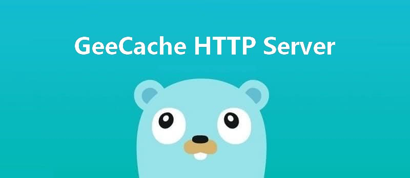

This article is the third part of the [7 Days Go Distributed Cache from scratch](https://geektutu.com/post/geecache.html) series.

- Introduces how to build an HTTP Server with Go's standard library `http`
- Implements a main function that starts the HTTP Server to test the API, **about 60 lines of code**

## 1 The http Standard Library

Go provides the `http` standard library, which makes it very easy to build HTTP servers and clients. For example, we can implement a server that returns the string "Hello World!" no matter what request it receives.

```go
package main

import (
	"log"
	"net/http"
)

type server int

func (h *server) ServeHTTP(w http.ResponseWriter, r *http.Request) {
	log.Println(r.URL.Path)
	w.Write([]byte("Hello World!"))
}

func main() {
	var s server
	http.ListenAndServe("localhost:9999", &s)
}
```

- Create an arbitrary type `server` and implement the `ServeHTTP` method.
- Call `http.ListenAndServe` to start the HTTP service on port 9999, with `s server` as the object that handles requests.

Next, we run `go run .` to start the service and use curl to test the result:

```bash
$ curl http://localhost:9999  
Hello World!
$ curl http://localhost:9999/abc
Hello World!
```

Go program log output:

```bash
2020/02/11 22:56:32 /
2020/02/11 22:56:34 /abc
```

> `http.ListenAndServe` takes 2 arguments: the first is the address the service listens on, and the second is the Handler. Any object that implements the `ServeHTTP` method can serve as an HTTP Handler.

In the standard library, the http.Handler interface is defined as follows:

```go
package http

type Handler interface {
    ServeHTTP(w ResponseWriter, r *Request)
}
```

## 2 GeeCache HTTP Server

A distributed cache requires communication between nodes, and building an HTTP-based communication mechanism is a common and simple approach. If a node starts an HTTP service, that node can be accessed by other nodes. Today we will set up an HTTP Server for the single-node instance.

To keep it decoupled from the other parts, we put this code in a new `http.go` file. The current code structure is as follows:

```bash
geecache/
    |--lru/
        |--lru.go  // lru cache eviction strategy
    |--byteview.go // abstraction and encapsulation of the cached value
    |--cache.go    // concurrency control
    |--geecache.go // interacts with the outside, controlling the main flow of cache storage and retrieval
	|--http.go     // provides the ability to be accessed by other nodes (http-based)
```

First, we create a struct `HTTPPool` as the core data structure that carries HTTP communication between nodes (covering both the server and the client sides; today we only implement the server side).

[day3-http-server/geecache/http.go - github](https://github.com/geektutu/7days-golang/tree/master/gee-cache/day3-http-server/geecache)

```go
package geecache

import (
	"fmt"
	"log"
	"net/http"
	"strings"
)

const defaultBasePath = "/_geecache/"

// HTTPPool implements PeerPicker for a pool of HTTP peers.
type HTTPPool struct {
	// this peer's base URL, e.g. "https://example.net:8000"
	self     string
	basePath string
}

// NewHTTPPool initializes an HTTP pool of peers.
func NewHTTPPool(self string) *HTTPPool {
	return &HTTPPool{
		self:     self,
		basePath: defaultBasePath,
	}
}
```

- `HTTPPool` has only 2 fields. One is self, which records its own address, including the hostname/IP and port.
- The other is basePath, which serves as the prefix of the address for inter-node communication; by default it is `/_geecache/`. Requests starting with http://example.com/_geecache/ are used for inter-node access. Since a host may also host other services, adding a path segment is a good habit. For example, the API endpoints of most websites generally use `/api` as a prefix.

Next, we implement the most core `ServeHTTP` method.

```go
// Log info with server name
func (p *HTTPPool) Log(format string, v ...interface{}) {
	log.Printf("[Server %s] %s", p.self, fmt.Sprintf(format, v...))
}

// ServeHTTP handle all http requests
func (p *HTTPPool) ServeHTTP(w http.ResponseWriter, r *http.Request) {
	if !strings.HasPrefix(r.URL.Path, p.basePath) {
		panic("HTTPPool serving unexpected path: " + r.URL.Path)
	}
	p.Log("%s %s", r.Method, r.URL.Path)
	// /<basepath>/<groupname>/<key> required
	parts := strings.SplitN(r.URL.Path[len(p.basePath):], "/", 2)
	if len(parts) != 2 {
		http.Error(w, "bad request", http.StatusBadRequest)
		return
	}

	groupName := parts[0]
	key := parts[1]

	group := GetGroup(groupName)
	if group == nil {
		http.Error(w, "no such group: "+groupName, http.StatusNotFound)
		return
	}

	view, err := group.Get(key)
	if err != nil {
		http.Error(w, err.Error(), http.StatusInternalServerError)
		return
	}

	w.Header().Set("Content-Type", "application/octet-stream")
	w.Write(view.ByteSlice())
}
```

- The implementation of ServeHTTP is fairly simple: first check whether the prefix of the request path is `basePath`; if not, return an error.
- We define the URL path format as `/<basepath>/<groupname>/<key>`; we get the group instance via groupname, then use `group.Get(key)` to fetch the cached data.
- Finally, `w.Write()` returns the cached value as the body of the httpResponse.

At this point, the HTTP server is fully implemented. Next, we will start the HTTP service on a single machine and test it with curl.

## 3 Testing

Implement the main function to instantiate a group and start the HTTP service.

[day3-http-server/main.go - github](https://github.com/geektutu/7days-golang/tree/master/gee-cache/day3-http-server)

```go
package main

import (
	"fmt"
	"geecache"
	"log"
	"net/http"
)

var db = map[string]string{
	"Tom":  "630",
	"Jack": "589",
	"Sam":  "567",
}

func main() {
	geecache.NewGroup("scores", 2<<10, geecache.GetterFunc(
		func(key string) ([]byte, error) {
			log.Println("[SlowDB] search key", key)
			if v, ok := db[key]; ok {
				return []byte(v), nil
			}
			return nil, fmt.Errorf("%s not exist", key)
		}))

	addr := "localhost:9999"
	peers := geecache.NewHTTPPool(addr)
	log.Println("geecache is running at", addr)
	log.Fatal(http.ListenAndServe(addr, peers))
}
```

- Likewise, we use a map to simulate the data source db.
- Create a Group named scores; if the cache is empty, the callback function fetches the data from db and returns it.
- Use http.ListenAndServe to start the HTTP service on port 9999.

> Points to note:
> main.go and geecache/ are in the same directory, but go modules no longer supports import <relative path>; relative paths need to be declared in go.mod:
> require geecache v0.0.0
> replace geecache => ./geecache

Next, run the main function and do some simple tests with curl:

```bash
$ curl http://localhost:9999/_geecache/scores/Tom
630
$ curl http://localhost:9999/_geecache/scores/kkk
kkk not exist
```

GeeCache's log output looks like this:

```bash
2020/02/11 23:28:39 geecache is running at localhost:9999
2020/02/11 23:29:08 [Server localhost:9999] GET /_geecache/scores/Tom
2020/02/11 23:29:08 [SlowDB] search key Tom
2020/02/11 23:29:16 [Server localhost:9999] GET /_geecache/scores/kkk
2020/02/11 23:29:16 [SlowDB] search key kkk
```

Communication between nodes requires not only an HTTP server but also an HTTP client—that is what we will do next.

## Further Reading

- [A Concise Go Tutorial](https://geektutu.com/post/quick-golang.html)
- [A Concise Go Test Unit Testing Tutorial](https://geektutu.com/post/quick-go-test.html)
- [Go http.Handler Basics](https://geektutu.com/post/gee-day1.html)
- [Official http Documentation - golang.org](https://golang.org/pkg/http)
