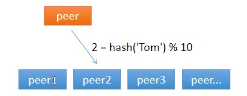
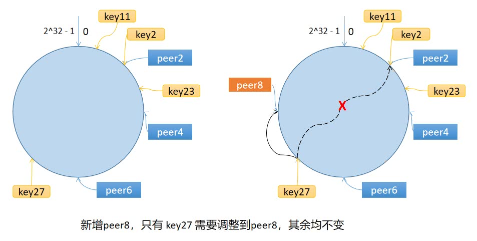

This article is part 4 of the [7 Days Go Distributed Cache Tutorial Series from scratch](https://geektutu.com/post/geecache.html).

- The principle of consistent hashing and why it should be used.
- Implement consistent hashing with corresponding test cases, **about 60 lines of code**

## 1 Why Consistent Hashing

Today we are going to implement the consistent hashing algorithm, an important step for GeeCache to move from a single node to distributed nodes. You may ask,

> My friend, what exactly is the consistent hashing algorithm? Why should we use it? What does it have to do with distributed systems?

### 1.1 Whom Should I Ask?

In a distributed cache, when a node receives a request and does not store the cached value itself, it faces a dilemma: where should it fetch the data from? From itself, or from node 1, 2, 3, 4...? Suppose there are 10 nodes in total, including itself. When a node receives a request, it picks one node at random, and that node fetches the data from the data source.

Suppose node 1 is chosen the first time; node 1 fetches the data from the data source and caches it at the same time. The second time, there is only a 1/10 chance of choosing node 1 again and a 9/10 chance of choosing another node. If another node is chosen, the data has to be fetched from the data source again, which is generally a time-consuming operation. This approach has two drawbacks: first, the cache is inefficient; second, all the nodes store the same data, wasting a large amount of storage space.

So what can we do to make sure that, for a given key, the same node is chosen every time? A hash algorithm can do exactly this. For example, could we sum up the ASCII codes of every character in the key and take the remainder when divided by 10? Of course — that can be regarded as a custom hash algorithm.



As shown in the figure above, whenever any node requests the value for the key `Tom` at any time, it is assigned to node 2, which effectively solves the problem described above.

### 1.2 What If the Number of Nodes Changes?

Computing a simple hash solves the cache performance problem, but it does not take into account changes in the number of nodes. Suppose one node is removed, leaving only 9 nodes. Then `hash(key) % 10` becomes `hash(key) % 9`, which means the node corresponding to almost every cached value changes — that is, almost all cached values become invalid. When nodes receive the corresponding requests, they all have to fetch data from the data source again, which can easily cause a `cache avalanche`.

> Cache avalanche: all cached entries expire at the same moment, causing a sudden surge of DB requests and a sharp increase in pressure, which triggers an avalanche. It is often caused by a cache server going down, or by cached entries being assigned the same expiration time.

How can this problem be solved? Consistent hashing can.

## 2 How the Algorithm Works

### 2.1 Steps

The consistent hashing algorithm maps keys into a space of 2^32. Connecting the beginning and the end of this space forms a ring.

- Compute the hash of each node/machine (usually based on the node's name, ID, or IP address) and place it on the ring.
- Compute the hash of the key, place it on the ring, and walk clockwise; the first node found is the node/machine to choose.



The ring has three nodes: peer2, peer4 and peer6. `key11`, `key2` and `key27` all map to peer2, and `key23` maps to peer4. Now suppose a new node/machine peer8 is added at the position shown in the figure. Only `key27` is moved from peer2 to peer8; all other mappings remain unchanged.

In other words, when nodes are added or removed, the consistent hashing algorithm only needs to remap a small portion of the data near that node, instead of remapping everything, which solves the problem described above.

### 2.2 Data Skew

If there are too few server nodes, keys can easily become skewed. For example, in the case above, peer2, peer4 and peer6 are distributed on the upper half of the ring, leaving the lower half empty. Then every key mapped to the lower half of the ring is assigned to peer2 — keys skew heavily toward peer2, and the load across cache nodes becomes unbalanced.

To solve this problem, the concept of virtual nodes is introduced: one physical node corresponds to multiple virtual nodes.

Suppose one physical node corresponds to 3 virtual nodes. Then the virtual nodes of peer1 are peer1-1, peer1-2 and peer1-3 (usually implemented by appending a number), and the other nodes are treated in the same way.

- The first step is to compute the hash of each virtual node and place it on the ring.
- The second step is to compute the hash of the key, walk clockwise on the ring to find the virtual node to choose — for example peer2-1 — which corresponds to the physical node peer2.

Virtual nodes expand the number of nodes, solving the problem of data skew when there are few nodes. Moreover, the cost is tiny: it only requires an extra dictionary (map) to maintain the mapping between physical nodes and virtual nodes.

## 3 Implementation in Go

We create a new package `consistenthash` under the geecache directory to implement the consistent hashing algorithm.

[day4-consistent-hash/geecache/consistenthash/consistenthash.go](https://github.com/geektutu/7days-golang/tree/master/gee-cache/day4-consistent-hash/geecache/consistenthash)

```go
package consistenthash

import (
	"hash/crc32"
	"sort"
	"strconv"
)

// Hash maps bytes to uint32
type Hash func(data []byte) uint32

// Map constains all hashed keys
type Map struct {
	hash     Hash
	replicas int
	keys     []int // Sorted
	hashMap  map[int]string
}

// New creates a Map instance
func New(replicas int, fn Hash) *Map {
	m := &Map{
		replicas: replicas,
		hash:     fn,
		hashMap:  make(map[int]string),
	}
	if m.hash == nil {
		m.hash = crc32.ChecksumIEEE
	}
	return m
}
```

- Defines the function type `Hash`. Using dependency injection, it allows users to replace it with a custom hash function, which also makes it easy to swap out for testing. The default is the `crc32.ChecksumIEEE` algorithm.
- `Map` is the main data structure of the consistent hashing algorithm and contains 4 fields: the hash function `hash`; the virtual node multiplier `replicas`; the hash ring `keys`; and the mapping table `hashMap` between virtual nodes and physical nodes, where the key is the virtual node's hash value and the value is the physical node's name.
- The constructor `New()` allows customizing the virtual node multiplier and the hash function.

Next, implement the `Add()` method for adding physical nodes/machines.

```go
// Add adds some keys to the hash.
func (m *Map) Add(keys ...string) {
	for _, key := range keys {
		for i := 0; i < m.replicas; i++ {
			hash := int(m.hash([]byte(strconv.Itoa(i) + key)))
			m.keys = append(m.keys, hash)
			m.hashMap[hash] = key
		}
	}
	sort.Ints(m.keys)
}
```

- The `Add` function accepts zero or more names of physical nodes.
- For each physical node `key`, `m.replicas` virtual nodes are created. A virtual node's name is `strconv.Itoa(i) + key`, that is, different virtual nodes are distinguished by appending a number.
- Use `m.hash()` to compute the hash value of each virtual node, and `append(m.keys, hash)` to add it to the ring.
- Add the mapping between the virtual node and the physical node to `hashMap`.
- The last step is to sort the hash values on the ring.

The final step is to implement the `Get()` method that picks a node.

```go
// Get gets the closest item in the hash to the provided key.
func (m *Map) Get(key string) string {
	if len(m.keys) == 0 {
		return ""
	}

	hash := int(m.hash([]byte(key)))
	// Binary search for appropriate replica.
	idx := sort.Search(len(m.keys), func(i int) bool {
		return m.keys[i] >= hash
	})

	return m.hashMap[m.keys[idx%len(m.keys)]]
}
```

- Picking a node is now quite simple. First, compute the hash of the key.
- Second, walk clockwise to find the index `idx` of the first matching virtual node and get the corresponding hash value from m.keys. If `idx == len(m.keys)`, then `m.keys[0]` should be chosen; since `m.keys` is a ring-like structure, this case is handled with the modulo operation.
- Third, look up the physical node through the `hashMap` mapping.

At this point, the entire consistent hashing algorithm is complete.

## 4 Testing

Finally, test cases are needed to verify that our implementation is correct.

[day4-consistent-hash/geecache/consistenthash/consistenthash_test.go](https://github.com/geektutu/7days-golang/tree/master/gee-cache/day4-consistent-hash/geecache/consistenthash)

```go
package consistenthash

import (
	"strconv"
	"testing"
)

func TestHashing(t *testing.T) {
	hash := New(3, func(key []byte) uint32 {
		i, _ := strconv.Atoi(string(key))
		return uint32(i)
	})

	// Given the above hash function, this will give replicas with "hashes":
	// 2, 4, 6, 12, 14, 16, 22, 24, 26
	hash.Add("6", "4", "2")

	testCases := map[string]string{
		"2":  "2",
		"11": "2",
		"23": "4",
		"27": "2",
	}

	for k, v := range testCases {
		if hash.Get(k) != v {
			t.Errorf("Asking for %s, should have yielded %s", k, v)
		}
	}

	// Adds 8, 18, 28
	hash.Add("8")

	// 27 should now map to 8.
	testCases["27"] = "8"

	for k, v := range testCases {
		if hash.Get(k) != v {
			t.Errorf("Asking for %s, should have yielded %s", k, v)
		}
	}

}
```

To run the tests, we need to know exactly the hash value of every key passed in; the default `crc32.ChecksumIEEE` algorithm clearly cannot achieve that. So a custom hash function is used here. The custom hash function only handles numbers: pass in a number in string form and it returns the corresponding number.

- Initially, there are three physical nodes, 2/4/6, and the hash values of their virtual nodes are 02/12/22, 04/14/24 and 06/16/26.
- The test cases 2/11/23/27 select the virtual nodes 02/12/24/02, that is, physical nodes 2/2/4/2.
- Adding a physical node 8 creates virtual nodes with hash values 08/18/28. At this point, the virtual node for test case 27 changes from `02` to `28`, that is, physical node 8.

## Recommended Reading

- [A Quick Go Tutorial](https://geektutu.com/post/quick-golang.html)
- [A Quick Guide to Go Unit Testing](https://geektutu.com/post/quick-go-test.html)
