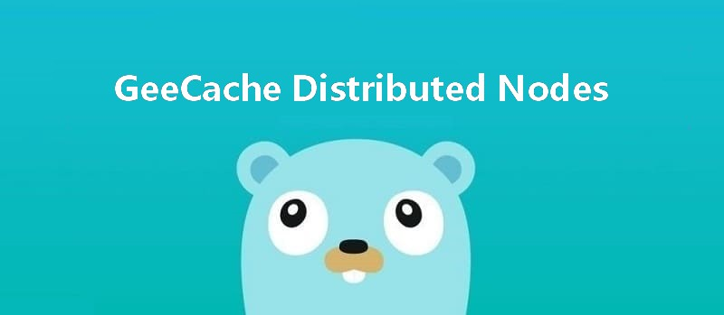

This article is part 5 of the [7 Days Go Distributed Cache Tutorial Series from scratch](https://geektutu.com/post/geecache.html).

- Register peers and select nodes with the help of the consistent hashing algorithm.
- Implement an HTTP client to communicate with the servers of remote nodes, **about 90 lines of code**

## 1 Review of the Flow

```bash
                          yes
receive key --> check if cached -----> return cached value ⑴
                |  no                            yes
                |-----> fetch from a remote node? -----> interact with the remote node --> return cached value ⑵
                          |  no
                          |-----> call the `callback function`, fetch the value and add it to the cache --> return cached value ⑶
```

We described the geecache flow in [GeeCache Day 2](https://geektutu.com/post/geecache-day2.html). Steps ⑴ and ⑶ have already been implemented; today we implement step ⑵, fetching cached values from remote nodes.

Let's take a closer look at step ⑵:

```bash
pick a node with consistent hashing        yes                                     yes
    |-----> is it a remote node? -----> HTTP client accesses the remote node --> success? -----> the server returns the value
                    |  no                                        ↓  no
                    |----------------------------> fall back to the local node for processing.
```

## 2 Abstracting PeerPicker

[day5-multi-nodes/geecache/peers.go - github](https://github.com/geektutu/7days-golang/tree/master/gee-cache/day5-multi-nodes/geecache)


```go
package geecache

// PeerPicker is the interface that must be implemented to locate
// the peer that owns a specific key.
type PeerPicker interface {
	PickPeer(key string) (peer PeerGetter, ok bool)
}

// PeerGetter is the interface that must be implemented by a peer.
type PeerGetter interface {
	Get(group string, key string) ([]byte, error)
}
```

- Here, two interfaces are abstracted. PeerPicker's `PickPeer()` method is used to select the corresponding node (PeerGetter) for a given key.
- The PeerGetter interface's `Get()` method is used to look up the cached value from the corresponding group. PeerGetter corresponds to the HTTP client in the flow above.

## 3 Node Selection and the HTTP Client


In [GeeCache Day 3](https://geektutu.com/post/geecache-day3.html) we implemented the server side of `HTTPPool`. Communication requires both a server and a client, so next we implement the client side of `HTTPPool`.

First, create a concrete HTTP client type `httpGetter` that implements the PeerGetter interface.

[day5-multi-nodes/geecache/http.go - github](https://github.com/geektutu/7days-golang/tree/master/gee-cache/day5-multi-nodes/geecache)

```go
type httpGetter struct {
	baseURL string
}

func (h *httpGetter) Get(group string, key string) ([]byte, error) {
	u := fmt.Sprintf(
		"%v%v/%v",
		h.baseURL,
		url.QueryEscape(group),
		url.QueryEscape(key),
	)
	res, err := http.Get(u)
	if err != nil {
		return nil, err
	}
	defer res.Body.Close()

	if res.StatusCode != http.StatusOK {
		return nil, fmt.Errorf("server returned: %v", res.Status)
	}

	bytes, err := ioutil.ReadAll(res.Body)
	if err != nil {
		return nil, fmt.Errorf("reading response body: %v", err)
	}

	return bytes, nil
}

var _ PeerGetter = (*httpGetter)(nil)
```

- baseURL is the address of the remote node to access, for example `http://example.com/_geecache/`.
- Use `http.Get()` to fetch the response and convert it to the `[]bytes` type.

Second, add node selection to HTTPPool.

```go
const (
	defaultBasePath = "/_geecache/"
	defaultReplicas = 50
)
// HTTPPool implements PeerPicker for a pool of HTTP peers.
type HTTPPool struct {
	// this peer's base URL, e.g. "https://example.net:8000"
	self        string
	basePath    string
	mu          sync.Mutex // guards peers and httpGetters
	peers       *consistenthash.Map
	httpGetters map[string]*httpGetter // keyed by e.g. "http://10.0.0.2:8008"
}
```

- Adds the field `peers`, of type `Map` from the consistent hashing algorithm, used to select a node for a specific key.
- Adds the field `httpGetters`, mapping remote nodes to their corresponding httpGetter. Each remote node corresponds to one httpGetter, because an httpGetter is tied to the remote node's address `baseURL`.

Third, implement the PeerPicker interface.

```go
// Set updates the pool's list of peers.
func (p *HTTPPool) Set(peers ...string) {
	p.mu.Lock()
	defer p.mu.Unlock()
	p.peers = consistenthash.New(defaultReplicas, nil)
	p.peers.Add(peers...)
	p.httpGetters = make(map[string]*httpGetter, len(peers))
	for _, peer := range peers {
		p.httpGetters[peer] = &httpGetter{baseURL: peer + p.basePath}
	}
}

// PickPeer picks a peer according to key
func (p *HTTPPool) PickPeer(key string) (PeerGetter, bool) {
	p.mu.Lock()
	defer p.mu.Unlock()
	if peer := p.peers.Get(key); peer != "" && peer != p.self {
		p.Log("Pick peer %s", peer)
		return p.httpGetters[peer], true
	}
	return nil, false
}

var _ PeerPicker = (*HTTPPool)(nil)
```

- The `Set()` method instantiates the consistent hashing algorithm and adds the given nodes.
- It also creates an HTTP client, `httpGetter`, for each node.
- `PickPeer()` wraps the `Get()` method of the consistent hashing algorithm: for a specific key it selects a node and returns the HTTP client corresponding to that node.

At this point, HTTPPool is capable of both serving HTTP and creating an HTTP client to fetch cached values from remote nodes for a specific key.

## 4 Implementing the Main Flow

Finally, we need to integrate the new features above into the main flow (geecache.go).

[day5-multi-nodes/geecache/geecache.go - github](https://github.com/geektutu/7days-golang/tree/master/gee-cache/day5-multi-nodes/geecache)

```go
// A Group is a cache namespace and associated data loaded spread over
type Group struct {
	name      string
	getter    Getter
	mainCache cache
	peers     PeerPicker
}

// RegisterPeers registers a PeerPicker for choosing remote peer
func (g *Group) RegisterPeers(peers PeerPicker) {
	if g.peers != nil {
		panic("RegisterPeerPicker called more than once")
	}
	g.peers = peers
}

func (g *Group) load(key string) (value ByteView, err error) {
	if g.peers != nil {
		if peer, ok := g.peers.PickPeer(key); ok {
			if value, err = g.getFromPeer(peer, key); err == nil {
				return value, nil
			}
			log.Println("[GeeCache] Failed to get from peer", err)
		}
	}

	return g.getLocally(key)
}

func (g *Group) getFromPeer(peer PeerGetter, key string) (ByteView, error) {
	bytes, err := peer.Get(g.name, key)
	if err != nil {
		return ByteView{}, err
	}
	return ByteView{b: bytes}, nil
}
```

- Adds the `RegisterPeers()` method, which injects the HTTPPool (which implements the PeerPicker interface) into the Group.
- Adds the `getFromPeer()` method, which uses the httpGetter (which implements the PeerGetter interface) to access a remote node and fetch the cached value.
- Modifies the load method to select a node with `PickPeer()`. If it is not the local node, `getFromPeer()` is called to fetch from the remote node. If it is the local node, or the fetch fails, it falls back to `getLocally()`.

## 5 Testing with the main Function

[day5-multi-nodes/main.go - github](https://github.com/geektutu/7days-golang/tree/master/gee-cache/day5-multi-nodes)

```go
var db = map[string]string{
	"Tom":  "630",
	"Jack": "589",
	"Sam":  "567",
}

func createGroup() *geecache.Group {
	return geecache.NewGroup("scores", 2<<10, geecache.GetterFunc(
		func(key string) ([]byte, error) {
			log.Println("[SlowDB] search key", key)
			if v, ok := db[key]; ok {
				return []byte(v), nil
			}
			return nil, fmt.Errorf("%s not exist", key)
		}))
}

func startCacheServer(addr string, addrs []string, gee *geecache.Group) {
	peers := geecache.NewHTTPPool(addr)
	peers.Set(addrs...)
	gee.RegisterPeers(peers)
	log.Println("geecache is running at", addr)
	log.Fatal(http.ListenAndServe(addr[7:], peers))
}

func startAPIServer(apiAddr string, gee *geecache.Group) {
	http.Handle("/api", http.HandlerFunc(
		func(w http.ResponseWriter, r *http.Request) {
			key := r.URL.Query().Get("key")
			view, err := gee.Get(key)
			if err != nil {
				http.Error(w, err.Error(), http.StatusInternalServerError)
				return
			}
			w.Header().Set("Content-Type", "application/octet-stream")
			w.Write(view.ByteSlice())

		}))
	log.Println("fontend server is running at", apiAddr)
	log.Fatal(http.ListenAndServe(apiAddr[7:], nil))

}

func main() {
	var port int
	var api bool
	flag.IntVar(&port, "port", 8001, "Geecache server port")
	flag.BoolVar(&api, "api", false, "Start a api server?")
	flag.Parse()

	apiAddr := "http://localhost:9999"
	addrMap := map[int]string{
		8001: "http://localhost:8001",
		8002: "http://localhost:8002",
		8003: "http://localhost:8003",
	}

	var addrs []string
	for _, v := range addrMap {
		addrs = append(addrs, v)
	}

	gee := createGroup()
	if api {
		go startAPIServer(apiAddr, gee)
	}
	startCacheServer(addrMap[port], []string(addrs), gee)
}
```

The main function contains quite a lot of code, but the logic is very simple.

- `startCacheServer()` starts a cache server: it creates an HTTPPool, adds the node information, registers it with gee, and starts the HTTP service (3 ports in total: 8001/8002/8003), invisible to users.
- `startAPIServer()` starts an API service (port 9999) that interacts with users, visible to users.
- `main()` takes 2 command-line parameters, `port` and `api`, used to start the HTTP service on the specified port.

For convenience, we wrap the startup commands in a `shell` script:

```bash
#!/bin/bash
trap "rm server;kill 0" EXIT

go build -o server
./server -port=8001 &
./server -port=8002 &
./server -port=8003 -api=1 &

sleep 2
echo ">>> start test"
curl "http://localhost:9999/api?key=Tom" &
curl "http://localhost:9999/api?key=Tom" &
curl "http://localhost:9999/api?key=Tom" &

wait
```

- The `trap` command is used to delete the temporary file and terminate child processes when the shell script exits.

```bash
$ ./run.sh
2020/02/16 21:17:43 geecache is running at http://localhost:8001
2020/02/16 21:17:43 geecache is running at http://localhost:8002
2020/02/16 21:17:43 geecache is running at http://localhost:8003
2020/02/16 21:17:43 fontend server is running at http://localhost:9999
>>> start test
2020/02/16 21:17:45 [Server http://localhost:8003] Pick peer http://localhost:8001
2020/02/16 21:17:45 [Server http://localhost:8003] Pick peer http://localhost:8001
2020/02/16 21:17:45 [Server http://localhost:8003] Pick peer http://localhost:8001
...
630630630
```

Now we can open a new shell to test:

```bash
$ curl "http://localhost:9999/api?key=Tom"
630
$ curl "http://localhost:9999/api?key=kkk"
kkk not exist
```

In the test, we sent 3 concurrent requests `?key=Tom`. From the logs, node `8001` was chosen all three times — that is thanks to the consistent hashing algorithm. But there is one problem: 3 requests were sent to `8001` at the same time. Imagine 100,000 concurrent requests for this data — `8001` would receive 100,000 simultaneous requests, and if `8001` in turn sent 100,000 simultaneous query requests to the database, a cache breakdown could easily occur.

The results of the three requests are identical. For the same key, can we send only one request to `8001`? We will solve this problem next time.

## Recommended Reading

- [A Quick Go Tutorial](https://geektutu.com/post/quick-golang.html)
- [A Quick Guide to Go Unit Testing](https://geektutu.com/post/quick-go-test.html)
