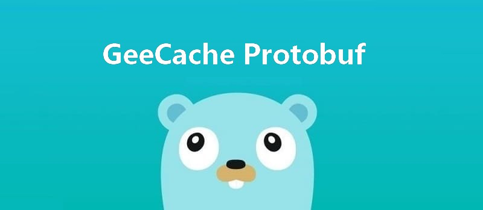

This article is part 7 of the [7 Days Go Distributed Cache Tutorial Series from scratch](https://geektutu.com/post/geecache.html).

- Why use protobuf?
- Use protobuf for communication between nodes, encoding messages to improve efficiency. **about 50 lines of code**

## 1 Why Use Protobuf

> protobuf, i.e. Protocol Buffers, is a data description language developed by Google. It is a lightweight and efficient structured data storage format, independent of language and platform, extensible and serializable. protobuf stores data in binary form and takes up little space.

For the installation and usage of protobuf, please refer to [A Quick Go Protobuf Tutorial](https://geektutu.com/post/quick-go-protobuf.html); this article will not repeat it. protobuf is widely used for binary transfer in remote procedure calls (RPC). The purpose of using protobuf is very simple: to achieve higher performance. Encoding with protobuf before transfer and decoding on the receiver's side can significantly reduce the size of the binary transfer. On the other hand, protobuf is very well suited for transmitting structured data, making it easy to extend the fields used for communication.

Using protobuf generally involves the following 2 steps:

- Following protobuf's syntax, define the data structures in a `.proto` file and use `protoc` to generate Go code (the `.proto` file is cross-platform; it can also generate source files in C, Java, and other languages).
- Reference the generated Go code in the project's code.

## 2 Communicating with Protobuf

Create a new package `geecachepb` and define `geecachepb.proto`

[day7-proto-buf/geecache/geecachepb/geecachepb.proto - github](https://github.com/geektutu/7days-golang/tree/master/gee-cache/day7-proto-buf/geecache/geecachepb)

```go
syntax = "proto3";

package geecachepb;

message Request {
  string group = 1;
  string key = 2;
}

message Response {
  bytes value = 1;
}

service GroupCache {
  rpc Get(Request) returns (Response);
}
```

- `Request` contains 2 fields, group and key, which match the parameters required by the interface `/_geecache/<group>/<name>` we defined earlier.
- `Response` contains 1 field, bytes, of type byte array, which also matches.

Generate `geecache.pb.go`

```bash
$ protoc --go_out=. *.proto
$ ls
geecachepb.pb.go  geecachepb.proto
```

As you can see, `geecachepb.pb.go` contains the following data types:

```go
type Request struct {
	Group string   `protobuf:"bytes,1,opt,name=group,proto3" json:"group,omitempty"`
    Key   string   `protobuf:"bytes,2,opt,name=key,proto3" json:"key,omitempty"`
    ...
}
type Response struct {
	Value []byte   `protobuf:"bytes,1,opt,name=value,proto3" json:"value,omitempty"`
}
```

Next, modify the `PeerGetter` interface in `peers.go` so that its parameters use the data types from `geecachepb.pb.go`.

[day7-proto-buf/geecache/peers.go - github](https://github.com/geektutu/7days-golang/tree/master/gee-cache/day7-proto-buf/geecache)

```go
import pb "geecache/geecachepb"

type PeerGetter interface {
	Get(in *pb.Request, out *pb.Response) error
}
```

Finally, modify the places in `geecache.go` and `http.go` that use the `PeerGetter` interface.

[day7-proto-buf/geecache/geecache.go - github](https://github.com/geektutu/7days-golang/tree/master/gee-cache/day7-proto-buf/geecache)

```go
import (
    // ...
    pb "geecache/geecachepb"
)

func (g *Group) getFromPeer(peer PeerGetter, key string) (ByteView, error) {
	req := &pb.Request{
		Group: g.name,
		Key:   key,
	}
	res := &pb.Response{}
	err := peer.Get(req, res)
	if err != nil {
		return ByteView{}, err
	}
	return ByteView{b: res.Value}, nil
}
```

[day7-proto-buf/geecache/http.go - github](https://github.com/geektutu/7days-golang/tree/master/gee-cache/day7-proto-buf/geecache)

```go
import (
    // ...
	pb "geecache/geecachepb"
	"github.com/golang/protobuf/proto"
)

func (p *HTTPPool) ServeHTTP(w http.ResponseWriter, r *http.Request) {
    // ...
	// Write the value to the response body as a proto message.
	body, err := proto.Marshal(&pb.Response{Value: view.ByteSlice()})
	if err != nil {
		http.Error(w, err.Error(), http.StatusInternalServerError)
		return
	}
	w.Header().Set("Content-Type", "application/octet-stream")
	w.Write(body)
}

func (h *httpGetter) Get(in *pb.Request, out *pb.Response) error {
	u := fmt.Sprintf(
		"%v%v/%v",
		h.baseURL,
		url.QueryEscape(in.GetGroup()),
		url.QueryEscape(in.GetKey()),
	)
    res, err := http.Get(u)
	// ...
	if err = proto.Unmarshal(bytes, out); err != nil {
		return fmt.Errorf("decoding response body: %v", err)
	}

	return nil
}
```

- In `ServeHTTP()`, `proto.Marshal()` is used to encode the HTTP response.
- In `Get()`, `proto.Unmarshal()` is used to decode the HTTP response.

At this point, we have replaced the intermediate carrier of HTTP communication with protobuf. Run `run.sh` to test whether GeeCache works properly.

## Summary

With this article, the series "7 Days to Build a Distributed Cache GeeCache in Go from Scratch" is complete. A quick recap. On day 1, we implemented the LRU cache eviction algorithm to solve the problem of resource limits; on day 2, we implemented single-machine concurrency and provided users with a callback function for custom data sources; on day 3, we implemented the HTTP server; on day 4, we implemented the consistent hashing algorithm to solve the problem of picking remote nodes; on day 5, we created the HTTP client and implemented communication between multiple nodes; on day 6, we implemented singleflight to solve the cache breakdown problem; on day 7, we used the protobuf library to optimize the performance of communication between nodes. If you have read this far but haven't started writing code yet, get started now — it only takes about 100 lines of code a day.

## Recommended

- [A Quick Go Tutorial](https://geektutu.com/post/quick-golang.html)
- [A Quick Guide to Go Unit Testing](https://geektutu.com/post/quick-go-test.html)
- [A Quick Go Protobuf Tutorial](https://geektutu.com/post/quick-go-protobuf.html)
