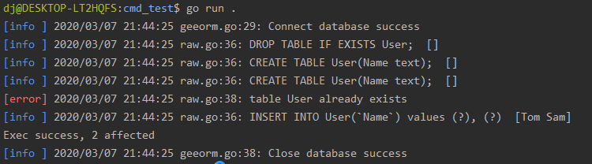

This article is part of the [7 Days Go ORM Framework Tutorial Series from scratch](https://geektutu.com/post/geeorm.html). It introduces:

- Basic SQLite operations (connecting to the database, creating tables, inserting and deleting records, etc.).
- Connecting to and operating on a SQLite database using the Go standard library database/sql, with a simple wrapper. **About 150 lines of code**

## 1 Getting Started with SQLite

> SQLite is a C-language library that implements a small, fast, self-contained, high-reliability, full-featured, SQL database engine.
> -- [SQLite official website](https://sqlite.org/index.html)

SQLite is a lightweight relational database that follows the ACID transaction principles. SQLite can be embedded directly into code; unlike MySQL or PostgreSQL, it does not require launching a separate service. SQLite stores data in a single disk file, which makes it very convenient to use. It is also well suited for beginners learning to use relational databases. All of GeeORM's development and testing is based on SQLite.

On Ubuntu, installing SQLite takes just one command, and it can be used without any configuration.

```bash
apt-get install sqlite3
```

Next, connect to the database (gee.db); if gee.db does not exist, it will be created. Once the connection succeeds, you enter SQLite's command-line mode, where `.help` shows all the help commands.

```bash
> sqlite3 gee.db
SQLite version 3.22.0 2018-01-22 18:45:57
Enter ".help" for usage hints.
sqlite>
```

Use an SQL statement to create a new table `User` with two fields, the string Name and the integer Age.

```bash
sqlite> CREATE TABLE User(Name text, Age integer);
```

Insert two records:

```bash
sqlite> INSERT INTO User(Name, Age) VALUES ("Tom", 18), ("Jack", 25);
```

Run some simple queries. Before doing so, use `.head on` to turn on the display of column names, so that the query results are easier to read.

```bash
sqlite> .head on

# Find records where `Age > 20`
sqlite> SELECT * FROM User WHERE Age > 20;
Name|Age
Jack|25

# Count the number of records
sqlite> SELECT COUNT(*) FROM User;
COUNT(*)
2
```

Use `.table` to list all tables in the current database, and `.schema <table>` to view the SQL statement that created a table.

```bash
sqlite> .table
User

sqlite> .schema User
CREATE TABLE User(Name text, Age integer);
```

That's enough about using SQLite for now — the usage covered above is enough for us to complete today's task. To learn more, refer to [Common SQLite Commands](https://geektutu.com/post/cheat-sheet-sqlite.html).


## 2 The database/sql Standard Library

Go provides the standard library `database/sql` for interacting with databases. Next, let's write a demo to see how this library is used.

```go
package main

import (
	"database/sql"
	"log"
	
	_ "github.com/mattn/go-sqlite3"
)

func main() {
	db, _ := sql.Open("sqlite3", "gee.db")
	defer func() { _ = db.Close() }()
	_, _ = db.Exec("DROP TABLE IF EXISTS User;")
	_, _ = db.Exec("CREATE TABLE User(Name text);")
	result, err := db.Exec("INSERT INTO User(`Name`) values (?), (?)", "Tom", "Sam")
	if err == nil {
		affected, _ := result.RowsAffected()
		log.Println(affected)
	}
	row := db.QueryRow("SELECT Name FROM User LIMIT 1")
	var name string
	if err := row.Scan(&name); err == nil {
		log.Println(name)
	}
}
```

> go-sqlite3 depends on gcc. To run this code on Windows, you need to install [mingw](http://mingw.org/) or another toolkit that includes the gcc compiler.

Run `go run .` and the output is as follows.

```bash
> go run .
2020/03/07 20:28:37 2
2020/03/07 20:28:37 Tom
```

- `sql.Open()` connects to the database. The first argument is the driver name; the import statement `_ "github.com/mattn/go-sqlite3"` registers the sqlite3 driver when the package is imported. The second argument is the database name, which for SQLite is the file name; if it does not exist, it will be created. It returns a pointer to a `sql.DB` instance.
- `Exec()` is used to execute an SQL statement; if it is a query statement, no records are returned. Queries are therefore usually executed with `Query()` and `QueryRow()`: the former can return multiple records, while the latter returns only one.
- `Exec()`, `Query()` and `QueryRow()` accept one or more arguments. The first argument is the SQL statement, and the following arguments are the values corresponding to the `?` placeholders in the SQL statement; placeholders are generally used to prevent SQL injection.
- `QueryRow()` returns a value of type `*sql.Row`. `row.Scan()` accepts one or more pointers as arguments and can retrieve the values of the corresponding columns. In this example there is only one column, `Name`, so passing the string pointer `&name` retrieves the query result.


With the basic SQL statements and the usage of Go's standard library `database/sql` covered, we can start building the prototype of the ORM framework.

## 3 Implementing a Simple log Library

Developing a framework/library is not easy, and detailed logs help us locate problems quickly. Therefore, before writing the core code, let's implement a simple log library in a few dozen lines of code.

> Why not use the built-in log library directly? The standard log library has no log levels and does not print the file name and line number, which means it is hard to quickly find out where an error occurred.

This simple log library has the following features:

- Supports log levels (three levels: Info, Error and Disabled).
- Uses different colors to distinguish between log levels when displayed.
- Shows the file name and line number of the code that printed the log.

```bash
go mod init geeorm
```

First, create a module named geeorm, and create the file log/log.go for the logging-related code. GeeORM now looks like this:

```bash
day1-database-sql/
    |--log/
        |--log.go
    |--go.mod
```

Step 1: create two logger instances, one for printing Info logs and one for printing Error logs.

[day1-database-sql/log/log.go](https://github.com/geektutu/7days-golang/tree/master/gee-orm/day1-database-sql/log)

```go
package log

import (
	"io/ioutil"
	"log"
	"os"
	"sync"
)

var (
	errorLog = log.New(os.Stdout, "\033[31m[error]\033[0m ", log.LstdFlags|log.Lshortfile)
	infoLog  = log.New(os.Stdout, "\033[34m[info ]\033[0m ", log.LstdFlags|log.Lshortfile)
	loggers  = []*log.Logger{errorLog, infoLog}
	mu       sync.Mutex
)

// log methods
var (
	Error  = errorLog.Println
	Errorf = errorLog.Printf
	Info   = infoLog.Println
	Infof  = infoLog.Printf
)
```

- `[info ]` is displayed in blue and `[error]` in red.
- `log.Lshortfile` enables displaying the file name and the line number of the code.
- Exposes four methods: `Error`, `Errorf`, `Info` and `Infof`.

Step 2: support setting the log level (InfoLevel, ErrorLevel, Disabled).

```go
// log levels
const (
	InfoLevel = iota
	ErrorLevel
	Disabled
)

// SetLevel controls log level
func SetLevel(level int) {
	mu.Lock()
	defer mu.Unlock()

	for _, logger := range loggers {
		logger.SetOutput(os.Stdout)
	}

	if ErrorLevel < level {
		errorLog.SetOutput(ioutil.Discard)
	}
	if InfoLevel < level {
		infoLog.SetOutput(ioutil.Discard)
	}
}
```

- This part is very simple to implement: the three levels are declared as three constants, and whether logs are printed is controlled via `Output`.
- If the level is set to ErrorLevel, infoLog's output is redirected to `ioutil.Discard`, i.e., the log is not printed.

At this point, a simple log library with level support is complete.

## 4 The Core Struct Session

Create a new folder session in the root directory for implementing the interaction with the database. Today we only implement the part that interacts natively by directly executing SQL statements; this part is implemented in `session/raw.go`.

[day1-database-sql/session/raw.go](https://github.com/geektutu/7days-golang/tree/master/gee-orm/day1-database-sql/session)

```go
package session

import (
	"database/sql"
	"geeorm/log"
	"strings"
)

type Session struct {
	db      *sql.DB
	sql     strings.Builder
	sqlVars []interface{}
}

func New(db *sql.DB) *Session {
	return &Session{db: db}
}

func (s *Session) Clear() {
	s.sql.Reset()
	s.sqlVars = nil
}

func (s *Session) DB() *sql.DB {
	return s.db
}

func (s *Session) Raw(sql string, values ...interface{}) *Session {
	s.sql.WriteString(sql)
	s.sql.WriteString(" ")
	s.sqlVars = append(s.sqlVars, values...)
	return s
}
```

- The Session struct currently contains only three member variables. The first is `db *sql.DB`, the pointer returned after successfully connecting to the database with `sql.Open()`.
- The second and third member variables are used to assemble the SQL statement and the values corresponding to the placeholders in the SQL statement. Calling the `Raw()` method changes the values of these two variables.

Next, wrap the three raw methods `Exec()`, `Query()` and `QueryRow()`.

```go
// Exec raw sql with sqlVars
func (s *Session) Exec() (result sql.Result, err error) {
	defer s.Clear()
	log.Info(s.sql.String(), s.sqlVars)
	if result, err = s.DB().Exec(s.sql.String(), s.sqlVars...); err != nil {
		log.Error(err)
	}
	return
}

// QueryRow gets a record from db
func (s *Session) QueryRow() *sql.Row {
	defer s.Clear()
	log.Info(s.sql.String(), s.sqlVars)
	return s.DB().QueryRow(s.sql.String(), s.sqlVars...)
}

// QueryRows gets a list of records from db
func (s *Session) QueryRows() (rows *sql.Rows, err error) {
	defer s.Clear()
	log.Info(s.sql.String(), s.sqlVars)
	if rows, err = s.DB().Query(s.sql.String(), s.sqlVars...); err != nil {
		log.Error(err)
	}
	return
}
```

- Wrapping serves two purposes. First, it prints logs uniformly (including the executed SQL statement and error logs).
- Second, after execution completes, it clears the two variables `(s *Session).sql` and `(s *Session).sqlVars`. This way the Session can be reused: one session can execute multiple SQL statements.

## 5 The Core Struct Engine

Session takes care of interacting with the database, while the preparation before the interaction (such as connecting to/testing the database) and the wrap-up afterwards (closing the connection) are left to Engine. Engine is the entry point for users to interact with GeeORM. The code is located in `geeorm.go` in the root directory.

[day1-database-sql/geeorm.go](https://github.com/geektutu/7days-golang/tree/master/gee-orm/day1-database-sql)

```go
package geeorm

import (
	"database/sql"

	"geeorm/log"
	"geeorm/session"
)

type Engine struct {
	db *sql.DB
}

func NewEngine(driver, source string) (e *Engine, err error) {
	db, err := sql.Open(driver, source)
	if err != nil {
		log.Error(err)
		return
	}
	// Send a ping to make sure the database connection is alive.
	if err = db.Ping(); err != nil {
		log.Error(err)
		return
	}
	e = &Engine{db: db}
	log.Info("Connect database success")
	return
}

func (engine *Engine) Close() {
	if err := engine.db.Close(); err != nil {
		log.Error("Failed to close database")
	}
	log.Info("Close database success")
}

func (engine *Engine) NewSession() *session.Session {
	return session.New(engine.db)
}
```

Engine's logic is very simple. Its most important method is `NewEngine`, which mainly does two things:

- Connects to the database and returns `*sql.DB`.
- Calls `db.Ping()` to check whether the database connection works.

In addition, Engine provides the `NewSession()` method, so that sessions can be created through an `Engine` instance and then used to interact with the database. At this point, the prototype of the whole GeeORM framework is in place.

```bash
day1-database-sql/
    |--log/          # log
        |--log.go
    |--session/      # database interaction
        |--raw.go
    |--geeorm.go     # user interaction
    |--go.mod 
```

## 6 Testing

GeeORM's unit tests are fairly complete; you can refer to the test files `log_test.go`, `raw_test.go` and `geeorm_test.go`, which we won't go through one by one here. Next, let's use geeorm as if it were a third-party library.

Create a cmd_test directory in the root directory for the test code, and create a new file main.go in it.

[day1-database-sql/cmd_test/main.go](https://github.com/geektutu/7days-golang/tree/master/gee-orm/day1-database-sql/cmd_test)

```go
package main

import (
	"geeorm"
	"geeorm/log"

	_ "github.com/mattn/go-sqlite3"
)

func main() {
	engine, _ := geeorm.NewEngine("sqlite3", "gee.db")
	defer engine.Close()
	s := engine.NewSession()
	_, _ = s.Raw("DROP TABLE IF EXISTS User;").Exec()
    _, _ = s.Raw("CREATE TABLE User(Name text);").Exec()
    _, _ = s.Raw("CREATE TABLE User(Name text);").Exec()
	result, _ := s.Raw("INSERT INTO User(`Name`) values (?), (?)", "Tom", "Sam").Exec()
	count, _ := result.RowsAffected()
	fmt.Printf("Exec success, %d affected\n", count)
}
```

Run `go run main.go` and you will see the following output:



The log contains an error message, *table User already exists*, because we executed the statement creating the table `User` twice in the main function. You can see that every log line shows the file and line number where the error occurred, and that different log levels are displayed in different colors.

## Recommended Reading

- [A Concise Go Tutorial](https://geektutu.com/post/quick-golang.html)
- [A Concise Tutorial on Go Unit Testing](https://geektutu.com/post/quick-go-test.html)
- [SQLite Common Commands Cheat Sheet](https://geektutu.com/post/cheat-sheet-sqlite.html)
