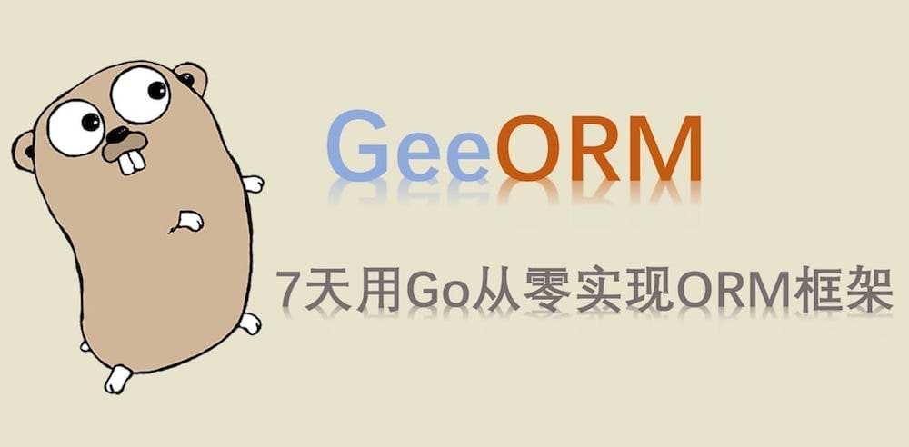

## 1 What Is an ORM Framework

> Object-Relational Mapping (ORM) automatically persists objects in object-oriented programs to relational databases, using metadata that describes the mapping between objects and the database.

So how are objects mapped to the database?

| Database | Object-oriented programming language |
|:---:|:---:|
| Table | Class/struct |
| Record (row) | Object |
| Field (column) | Attribute |

Here is a concrete example to help understand ORM.

```sql
CREATE TABLE `User` (`Name` text, `Age` integer);
INSERT INTO `User` (`Name`, `Age`) VALUES ("Tom", 18);
SELECT * FROM `User`;
```

The first SQL statement creates the table `User` in the database and defines two fields, `Name` and `Age`; the second SQL statement adds a record to the table; the last statement returns all records in the table.

If we use an ORM framework, we can write:

```go
type User struct {
    Name string
    Age  int
}

orm.CreateTable(&User{})
orm.Save(&User{"Tom", 18})
var users []User
orm.Find(&users)
```

An ORM framework acts as a bridge between objects and the database. With an ORM, you can avoid writing tedious SQL statements: by simply operating on objects, you can work with a relational database.

So how do we implement an ORM framework?

- The `CreateTable` method needs to obtain the name of the corresponding struct, `User`, from the argument `&User{}` as the table name, with the member variables Name and Age as column names; it also needs to know the types of the member variables.
- The `Save` method needs to know the value of each member variable.
- The `Find` method, given only the empty slice `&[]User`, needs to derive the corresponding struct name — that is, the table name `User` — fetch all records from the database, convert them into `User` objects, and append them to the slice.

If these methods only accepted arguments of type `User`, they would be easy to implement. But an ORM framework is generic — that is, it must be able to convert any valid object into tables and records in the database. For example:

```go
type Account struct {
    Username string
    Password string
}

orm.CreateTable(&Account{})
```

This raises an important question: how do we obtain the struct information corresponding to a pointer of an arbitrary type? This involves Go's reflection mechanism (reflect). Through reflection, you can obtain information about an object such as its struct name, member variables and methods. For example:

```go
typ := reflect.Indirect(reflect.ValueOf(&Account{})).Type()
fmt.Println(typ.Name()) // Account

for i := 0; i < typ.NumField(); i++ {
    field := typ.Field(i)
    fmt.Println(field.Name) // Username Password
}
```

- `reflect.ValueOf()` obtains the reflected value of the pointer.
- `reflect.Indirect()` obtains the reflected value of the object that the pointer points to.
- `(reflect.Type).Name()` returns the struct name (a string).
- `(reflect.Type).Field(i)` returns the i-th member variable.

Besides the mapping between objects and table schemas/records, what else should be considered when designing an ORM framework?

1) SQL statements differ across databases such as MySQL, PostgreSQL and SQLite. How can an ORM framework adapt to multiple databases without the developer noticing?

2) When an object's fields change, can the database table schema be updated automatically — that is, does it support automatic database migration (migrate)?

3) Databases support many features, such as transactions. Which of them can an ORM framework implement?

4) ...

## 2 About GeeORM

Databases offer a great many features. Using an ORM instead of SQL statements for simple CRUD operations is fine, but many features are hard to replace with an ORM. For example, complex multi-table join queries may also be supported by an ORM, but for performance reasons, hand-written SQL statements are likely to be more efficient.

Therefore, when designing and implementing an ORM framework, features need to be prioritized.

The most widely used ORM frameworks in Go are [gorm](https://github.com/jinzhu/gorm) and [xorm](https://github.com/go-xorm/xorm). Besides basic features such as table operations and CRUD on records, gorm also implements associations (one-to-one, one-to-many, etc.) and callback plugins; xorm implements read/write splitting (supporting multiple configured databases), data synchronization, import/export, and more.

gorm is undergoing a thorough rewrite of its v1 version, and the release of v2 is not in sight for the short term. Compared with gorm-v1, xorm has a clearer design. GeeORM's design is mainly inspired by xorm, with some implementation details borrowed from gorm. The purpose of GeeORM is mainly to understand the principles behind ORM framework design; robustness is not fully addressed in the implementation, and some complex features, such as gorm's associations and xorm's read/write splitting, are not implemented. The currently supported features are:

- Creating, dropping and migrating tables.
- CRUD operations on records, with chained operations for query conditions.
- Setting a single primary key.
- Hooks (before or after create/update/delete/query).
- Transactions.
- ...

`GeeORM` is implemented in 7 days, and the part completed each day can be run and tested independently. Like building blocks, the individual features combine together into the final ORM framework. Each day involves about 100 lines of code, accompanied by fairly complete unit tests.

## 3 Table of Contents

- Day 1: [database/sql Basics](https://geektutu.com/post/geeorm-day1.html) | [Code](https://github.com/geektutu/7days-golang/blob/master/gee-orm/day1-database-sql)
- Day 2: [Mapping Structs to Tables](https://geektutu.com/post/geeorm-day2.html) | [Code](https://github.com/geektutu/7days-golang/blob/master/gee-orm/day2-reflect-schema)
- Day 3: [Inserting and Querying Records](https://geektutu.com/post/geeorm-day3.html) | [Code](https://github.com/geektutu/7days-golang/blob/master/gee-orm/day3-save-query)
- Day 4: [Chained Operations and Update/Delete](https://geektutu.com/post/geeorm-day4.html) | [Code](https://github.com/geektutu/7days-golang/blob/master/gee-orm/day4-chain-operation)
- Day 5: [Implementing Hooks](https://geektutu.com/post/geeorm-day5.html) | [Code](https://github.com/geektutu/7days-golang/blob/master/gee-orm/day5-hooks)
- Day 6: [Supporting Transactions](https://geektutu.com/post/geeorm-day6.html) | [Code](https://github.com/geektutu/7days-golang/blob/master/gee-orm/day6-transaction)
- Day 7: [Database Migration](https://geektutu.com/post/geeorm-day7.html) | [Code](https://github.com/geektutu/7days-golang/blob/master/gee-orm/day7-migrate)


## Recommended Reading

- [A Concise Go Tutorial](https://geektutu.com/post/quick-golang.html)
- [A Concise Tutorial on Go Unit Testing](https://geektutu.com/post/quick-go-test.html)
- [Go Reflect: Improving Reflection Performance](https://geektutu.com/post/hpg-reflect.html)
- [SQLite Common Commands Cheat Sheet](https://geektutu.com/post/cheat-sheet-sqlite.html)
