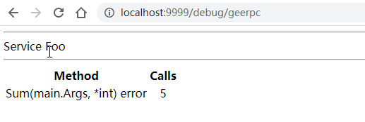

This article is the fifth part of the [7 Days Go RPC Framework Tutorial Series from scratch](https://geektutu.com/post/geerpc.html).

- Support the HTTP protocol
- Implement a simple Debug page based on HTTP, in about 150 lines of code.

## What Does Supporting HTTP Require?

In web development, we often send requests with HTTP methods such as HEAD, GET, and POST and wait for responses. However, the RPC message format is not compatible with the standard HTTP protocol, so in this case a protocol conversion is needed. The CONNECT method of HTTP happens to provide this capability; CONNECT is generally used for proxy services.

Suppose all HTTPS communication between the browser and the server is encrypted. When the browser initiates an HTTPS request through a proxy server, since the target site address and port are encrypted in the HTTPS request header, how does the proxy server know where to send the request? To solve this problem, the browser sends a CONNECT request to the proxy server in plain HTTP, telling it the target address and port. After receiving this request, the proxy server establishes a TCP connection with the target site on the corresponding port; once the connection is established successfully, it returns an HTTP 200 status code to tell the browser that the encrypted channel with the site is ready. From then on, the proxy server only needs to pass through the encrypted packets between the browser and the server; it does not need to parse the HTTPS messages.

A simple example:

1) The browser sends a CONNECT request to the proxy server.

```bash
CONNECT geektutu.com:443 HTTP/1.0
```

2) The proxy server returns an HTTP 200 status code, indicating that the connection has been established.

```bash
HTTP/1.0 200 Connection Established
```

3) The browser and the server then begin the HTTPS handshake and exchange encrypted data. The proxy server is only responsible for transmitting the packets between them and cannot read the actual data content (the proxy server may also choose to install a trusted root certificate to decrypt the HTTPS messages).

In fact, this process is exactly one of converting the HTTP protocol into the HTTPS protocol through a proxy server. For the RPC server, what needs to be done is converting the HTTP protocol into the RPC protocol; for the client, we need to add the logic of creating a connection through an HTTP CONNECT request.


## HTTP Support on the Server Side

The communication process should then look like this:

1) The client sends a CONNECT request to the RPC server

```bash
CONNECT 10.0.0.1:9999/_geerpc_ HTTP/1.0
```

2) The RPC server returns an HTTP 200 status code, indicating that the connection is established.

```bash
HTTP/1.0 200 Connected to Gee RPC
```

3) The client sends RPC messages over the established connection: first the Option, then N request messages. The server processes the RPC requests and responds.

Add the following methods to `server.go`:

[day5-http-debug/server.go](https://github.com/geektutu/7days-golang/tree/master/gee-rpc/day5-http-debug)

```go
const (
	connected        = "200 Connected to Gee RPC"
	defaultRPCPath   = "/_geeprc_"
	defaultDebugPath = "/debug/geerpc"
)

// ServeHTTP implements an http.Handler that answers RPC requests.
func (server *Server) ServeHTTP(w http.ResponseWriter, req *http.Request) {
	if req.Method != "CONNECT" {
		w.Header().Set("Content-Type", "text/plain; charset=utf-8")
		w.WriteHeader(http.StatusMethodNotAllowed)
		_, _ = io.WriteString(w, "405 must CONNECT\n")
		return
	}
	conn, _, err := w.(http.Hijacker).Hijack()
	if err != nil {
		log.Print("rpc hijacking ", req.RemoteAddr, ": ", err.Error())
		return
	}
	_, _ = io.WriteString(conn, "HTTP/1.0 "+connected+"\n\n")
	server.ServeConn(conn)
}

// HandleHTTP registers an HTTP handler for RPC messages on rpcPath.
// It is still necessary to invoke http.Serve(), typically in a go statement.
func (server *Server) HandleHTTP() {
	http.Handle(defaultRPCPath, server)
}

// HandleHTTP is a convenient approach for default server to register HTTP handlers
func HandleHTTP() {
	DefaultServer.HandleHTTP()
}
```

`defaultDebugPath` is reserved for the DEBUG page to be implemented later.

Handling HTTP requests in Go is a very simple matter. The implementation of `http.Handle` in the Go standard library is as follows:

```go
package http
// Handle registers the handler for the given pattern
// in the DefaultServeMux.
// The documentation for ServeMux explains how patterns are matched.
func Handle(pattern string, handler Handler) { DefaultServeMux.Handle(pattern, handler) }
```

The first parameter is a string pattern that supports wildcards; here we always pass in `/_geeprc_`. The second parameter is of type Handler. Handler is an interface type, defined as follows:

```go
type Handler interface {
    ServeHTTP(w ResponseWriter, r *Request)
}
```

In other words, implementing the Handler interface is all it takes to act as an HTTP handler and process HTTP requests. The Handler interface defines only one method, `ServeHTTP`, so we just need to implement it.

> For more about http.Handler, we recommend reading [Writing a Web Framework in Go - Gee Day 1 http.Handler](https://geektutu.com/post/gee-day1.html)

## HTTP Support on the Client Side

The server can already accept CONNECT requests and returns the 200 status code `HTTP/1.0 200 Connected to Gee RPC`. All the client needs to do is send a CONNECT request and check the returned status code to establish the connection successfully.

[day5-http-debug/client.go](https://github.com/geektutu/7days-golang/tree/master/gee-rpc/day5-http-debug)

```go
// NewHTTPClient new a Client instance via HTTP as transport protocol
func NewHTTPClient(conn net.Conn, opt *Option) (*Client, error) {
	_, _ = io.WriteString(conn, fmt.Sprintf("CONNECT %s HTTP/1.0\n\n", defaultRPCPath))

	// Require successful HTTP response
	// before switching to RPC protocol.
	resp, err := http.ReadResponse(bufio.NewReader(conn), &http.Request{Method: "CONNECT"})
	if err == nil && resp.Status == connected {
		return NewClient(conn, opt)
	}
	if err == nil {
		err = errors.New("unexpected HTTP response: " + resp.Status)
	}
	return nil, err
}

// DialHTTP connects to an HTTP RPC server at the specified network address
// listening on the default HTTP RPC path.
func DialHTTP(network, address string, opts ...*Option) (*Client, error) {
	return dialTimeout(NewHTTPClient, network, address, opts...)
}
```

After the connection is established via the HTTP CONNECT request, the subsequent communication is handed over to NewClient.

To simplify usage, a unified entry point `XDial` is provided:

```go
// XDial calls different functions to connect to a RPC server
// according the first parameter rpcAddr.
// rpcAddr is a general format (protocol@addr) to represent a rpc server
// eg, http@10.0.0.1:7001, tcp@10.0.0.1:9999, unix@/tmp/geerpc.sock
func XDial(rpcAddr string, opts ...*Option) (*Client, error) {
	parts := strings.Split(rpcAddr, "@")
	if len(parts) != 2 {
		return nil, fmt.Errorf("rpc client err: wrong format '%s', expect protocol@addr", rpcAddr)
	}
	protocol, addr := parts[0], parts[1]
	switch protocol {
	case "http":
		return DialHTTP("tcp", addr, opts...)
	default:
		// tcp, unix or other transport protocol
		return Dial(protocol, addr, opts...)
	}
}
```

Let's add a test case to try it out. This test case creates a socket connection over the unix protocol, which is suitable for communication within the local machine and works no differently from the TCP protocol in usage.

[day5-http-debug/client_test.go](https://github.com/geektutu/7days-golang/tree/master/gee-rpc/day5-http-debug)

```go
func TestXDial(t *testing.T) {
	if runtime.GOOS == "linux" {
		ch := make(chan struct{})
		addr := "/tmp/geerpc.sock"
		go func() {
			_ = os.Remove(addr)
			l, err := net.Listen("unix", addr)
			if err != nil {
				t.Fatal("failed to listen unix socket")
			}
			ch <- struct{}{}
			Accept(l)
		}()
		<-ch
		_, err := XDial("unix@" + addr)
		_assert(err == nil, "failed to connect unix socket")
	}
}
```


## Implementing a Simple DEBUG Page

The benefit of supporting the HTTP protocol is that the RPC service only uses the `/_geerpc` path of the listening port, leaving other paths available for richer features such as logging and statistics. Next, we present a call-statistics view of the services at `/debug/geerpc`.

[day5-http-debug/debug.go](https://github.com/geektutu/7days-golang/tree/master/gee-rpc/day5-http-debug)

```go
package geerpc

import (
	"fmt"
	"html/template"
	"net/http"
)

const debugText = `<html>
	<body>
	<title>GeeRPC Services</title>
	{{range .}}
	<hr>
	Service {{.Name}}
	<hr>
		<table>
		<th align=center>Method</th><th align=center>Calls</th>
		{{range $name, $mtype := .Method}}
			<tr>
			<td align=left font=fixed>{{$name}}({{$mtype.ArgType}}, {{$mtype.ReplyType}}) error</td>
			<td align=center>{{$mtype.NumCalls}}</td>
			</tr>
		{{end}}
		</table>
	{{end}}
	</body>
	</html>`

var debug = template.Must(template.New("RPC debug").Parse(debugText))

type debugHTTP struct {
	*Server
}

type debugService struct {
	Name   string
	Method map[string]*methodType
}

// Runs at /debug/geerpc
func (server debugHTTP) ServeHTTP(w http.ResponseWriter, req *http.Request) {
	// Build a sorted version of the data.
	var services []debugService
	server.serviceMap.Range(func(namei, svci interface{}) bool {
		svc := svci.(*service)
		services = append(services, debugService{
			Name:   namei.(string),
			Method: svc.method,
		})
		return true
	})
	err := debug.Execute(w, services)
	if err != nil {
		_, _ = fmt.Fprintln(w, "rpc: error executing template:", err.Error())
	}
}
```

Here, we return an HTML page that displays the call statistics for every method of every registered service.

Bind the debugHTTP instance to the path `/debug/geerpc`.

```go
func (server *Server) HandleHTTP() {
	http.Handle(defaultRPCPath, server)
	http.Handle(defaultDebugPath, debugHTTP{server})
	log.Println("rpc server debug path:", defaultDebugPath)
}
```

## Demo

OK, we can hardly wait to see the final result.

[day5-http-debug/main/main.go](https://github.com/geektutu/7days-golang/tree/master/gee-rpc/day5-http-debug)

Compared with the previous example, `geerpc.Accept()` in startServer is replaced with `geerpc.HandleHTTP()`, and the port is fixed at 9999.

```go
type Foo int

type Args struct{ Num1, Num2 int }

func (f Foo) Sum(args Args, reply *int) error {
	*reply = args.Num1 + args.Num2
	return nil
}

func startServer(addrCh chan string) {
	var foo Foo
	l, _ := net.Listen("tcp", ":9999")
	_ = geerpc.Register(&foo)
	geerpc.HandleHTTP()
	addrCh <- l.Addr().String()
	_ = http.Serve(l, nil)
}
```

On the client side, `Dial` is replaced with `DialHTTP`, and nothing else has changed.

```go
func call(addrCh chan string) {
	client, _ := geerpc.DialHTTP("tcp", <-addrCh)
	defer func() { _ = client.Close() }()

	time.Sleep(time.Second)
	// send request & receive response
	var wg sync.WaitGroup
	for i := 0; i < 5; i++ {
		wg.Add(1)
		go func(i int) {
			defer wg.Done()
			args := &Args{Num1: i, Num2: i * i}
			var reply int
			if err := client.Call(context.Background(), "Foo.Sum", args, &reply); err != nil {
				log.Fatal("call Foo.Sum error:", err)
			}
			log.Printf("%d + %d = %d", args.Num1, args.Num2, reply)
		}(i)
	}
	wg.Wait()
}

func main() {
	log.SetFlags(0)
	ch := make(chan string)
	go call(ch)
	startServer(ch)
}
```

In the main function, we call `startServer` at the end; once the service starts, it keeps waiting.

The output is as follows:

```bash
main$ go run .
rpc server: register Foo.Sum
rpc server debug path: /debug/geerpc
3 + 9 = 12
2 + 4 = 6
4 + 16 = 20
0 + 0 = 0
1 + 1 = 2
```

The service is up and running. If we now visit `localhost:9999/debug/geerpc` in a browser, we will see:



## Recommended Reading

- [A Concise Go Tutorial](https://geektutu.com/post/quick-golang.html)
- [Go Written Test and Interview Questions](https://geektutu.com/post/qa-golang.html)
