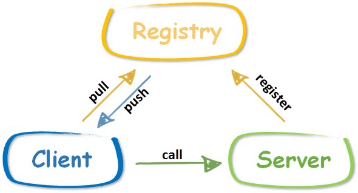

This is the seventh article in the [7 Days to Implement an RPC Framework GeeRPC in Go from Scratch](https://geektutu.com/post/geerpc.html) series.

- Implement a simple registry that supports service registration, heartbeat reception, and more
- Implement registry-based service discovery on the client side, in about 250 lines of code

## The Role of the Registry



The position of the registry is shown in the figure above. The benefit of a registry is that both the client and the server only need to be aware of the registry, without needing to be aware of each other. More specifically:

1) After the server starts up, it sends a registration message to the registry, so the registry knows that the service is up and in an available state. Generally, the server also needs to send heartbeats to the registry periodically to prove that it is still alive.
2) The client asks the registry which services are currently available, and the registry returns the list of available services to the client.
3) From the list of services obtained from the registry, the client picks one of them to make a call.

Without a registry — as in the Day 6 implementation of GeeRPC — the client would need to hard-code the addresses of the servers, and there would be no mechanism to guarantee whether a server is in an available state. Of course, a registry can do much more, such as dynamic configuration synchronization and notification mechanisms. Commonly used registries include [etcd](https://github.com/etcd-io/etcd), [zookeeper](https://github.com/apache/zookeeper), and [consul](https://github.com/hashicorp/consul); well-known microservice or RPC frameworks generally support all of these mainstream registries.


## Gee Registry

Mainstream registries such as etcd and zookeeper are powerful, but integrating with them takes a considerable amount of code and requires implementing many interfaces. GeeRPC chooses to implement its own simple registry that supports heartbeat-based keep-alive.

The code of GeeRegistry is placed in a separate subdirectory, registry.

First, define the GeeRegistry struct. The default timeout is set to 5 min, which means that any registered service is considered unavailable after more than 5 min.

[day7-registry/registry/registry.go](https://github.com/geektutu/7days-golang/tree/master/gee-rpc/day7-registry)

```go
// GeeRegistry is a simple register center, provide following functions.
// add a server and receive heartbeat to keep it alive.
// returns all alive servers and delete dead servers sync simultaneously.
type GeeRegistry struct {
	timeout time.Duration
	mu      sync.Mutex // protect following
	servers map[string]*ServerItem
}

type ServerItem struct {
	Addr  string
	start time.Time
}

const (
	defaultPath    = "/_geerpc_/registry"
	defaultTimeout = time.Minute * 5
)

// New create a registry instance with timeout setting
func New(timeout time.Duration) *GeeRegistry {
	return &GeeRegistry{
		servers: make(map[string]*ServerItem),
		timeout: timeout,
	}
}

var DefaultGeeRegister = New(defaultTimeout)
```

Implement methods for GeeRegistry to add a server instance and to return the list of servers.

- putServer: adds a server instance; if the server already exists, updates start.
- aliveServers: returns the list of available servers, deleting any that have timed out.

```go
func (r *GeeRegistry) putServer(addr string) {
	r.mu.Lock()
	defer r.mu.Unlock()
	s := r.servers[addr]
	if s == nil {
		r.servers[addr] = &ServerItem{Addr: addr, start: time.Now()}
	} else {
		s.start = time.Now() // if exists, update start time to keep alive
	}
}

func (r *GeeRegistry) aliveServers() []string {
	r.mu.Lock()
	defer r.mu.Unlock()
	var alive []string
	for addr, s := range r.servers {
		if r.timeout == 0 || s.start.Add(r.timeout).After(time.Now()) {
			alive = append(alive, addr)
		} else {
			delete(r.servers, addr)
		}
	}
	sort.Strings(alive)
	return alive
}
```

For simplicity of implementation, GeeRegistry serves over the HTTP protocol, with all useful information carried in HTTP headers.

- Get: returns the list of all available servers, carried in the custom field X-Geerpc-Servers.
- Post: adds a server instance or sends a heartbeat, carried in the custom field X-Geerpc-Server.

```go
// Runs at /_geerpc_/registry
func (r *GeeRegistry) ServeHTTP(w http.ResponseWriter, req *http.Request) {
	switch req.Method {
	case "GET":
		// keep it simple, server is in req.Header
		w.Header().Set("X-Geerpc-Servers", strings.Join(r.aliveServers(), ","))
	case "POST":
		// keep it simple, server is in req.Header
		addr := req.Header.Get("X-Geerpc-Server")
		if addr == "" {
			w.WriteHeader(http.StatusInternalServerError)
			return
		}
		r.putServer(addr)
	default:
		w.WriteHeader(http.StatusMethodNotAllowed)
	}
}

// HandleHTTP registers an HTTP handler for GeeRegistry messages on registryPath
func (r *GeeRegistry) HandleHTTP(registryPath string) {
	http.Handle(registryPath, r)
	log.Println("rpc registry path:", registryPath)
}

func HandleHTTP() {
	DefaultGeeRegister.HandleHTTP(defaultPath)
}
```

In addition, a Heartbeat method is provided, making it easy for a server to send heartbeats to the registry periodically after startup; by default, the interval is 1 min shorter than the expiry timeout configured in the registry.

```go
// Heartbeat send a heartbeat message every once in a while
// it's a helper function for a server to register or send heartbeat
func Heartbeat(registry, addr string, duration time.Duration) {
	if duration == 0 {
		// make sure there is enough time to send heart beat
		// before it's removed from registry
		duration = defaultTimeout - time.Duration(1)*time.Minute
	}
	var err error
	err = sendHeartbeat(registry, addr)
	go func() {
		t := time.NewTicker(duration)
		for err == nil {
			<-t.C
			err = sendHeartbeat(registry, addr)
		}
	}()
}

func sendHeartbeat(registry, addr string) error {
	log.Println(addr, "send heart beat to registry", registry)
	httpClient := &http.Client{}
	req, _ := http.NewRequest("POST", registry, nil)
	req.Header.Set("X-Geerpc-Server", addr)
	if _, err := httpClient.Do(req); err != nil {
		log.Println("rpc server: heart beat err:", err)
		return err
	}
	return nil
}
```

## GeeRegistryDiscovery

Implement the corresponding Discovery in xclient.

[day7-registry/xclient/discovery_gee.go](https://github.com/geektutu/7days-golang/tree/master/gee-rpc/day7-registry)

```go
package xclient

type GeeRegistryDiscovery struct {
	*MultiServersDiscovery
	registry   string
	timeout    time.Duration
	lastUpdate time.Time
}

const defaultUpdateTimeout = time.Second * 10

func NewGeeRegistryDiscovery(registerAddr string, timeout time.Duration) *GeeRegistryDiscovery {
	if timeout == 0 {
		timeout = defaultUpdateTimeout
	}
	d := &GeeRegistryDiscovery{
		MultiServersDiscovery: NewMultiServerDiscovery(make([]string, 0)),
		registry:              registerAddr,
		timeout:               timeout,
	}
	return d
}
```

- GeeRegistryDiscovery embeds MultiServersDiscovery, so many capabilities can be reused.
- registry is the address of the registry
- timeout is the expiry time of the list of servers
- lastUpdate records the last time the list of servers was updated from the registry; by default it expires after 10s, meaning that after 10s, a new list needs to be fetched from the registry.

Implement the Update and Refresh methods; the refetch-on-timeout logic lives in Refresh:

```go
func (d *GeeRegistryDiscovery) Update(servers []string) error {
	d.mu.Lock()
	defer d.mu.Unlock()
	d.servers = servers
	d.lastUpdate = time.Now()
	return nil
}

func (d *GeeRegistryDiscovery) Refresh() error {
	d.mu.Lock()
	defer d.mu.Unlock()
	if d.lastUpdate.Add(d.timeout).After(time.Now()) {
		return nil
	}
	log.Println("rpc registry: refresh servers from registry", d.registry)
	resp, err := http.Get(d.registry)
	if err != nil {
		log.Println("rpc registry refresh err:", err)
		return err
	}
	servers := strings.Split(resp.Header.Get("X-Geerpc-Servers"), ",")
	d.servers = make([]string, 0, len(servers))
	for _, server := range servers {
		if strings.TrimSpace(server) != "" {
			d.servers = append(d.servers, strings.TrimSpace(server))
		}
	}
	d.lastUpdate = time.Now()
	return nil
}
```

`Get` and `GetAll` are similar to those of MultiServersDiscovery; the only difference is that GeeRegistryDiscovery needs to call Refresh first to ensure the list of servers has not expired.

```go
func (d *GeeRegistryDiscovery) Get(mode SelectMode) (string, error) {
	if err := d.Refresh(); err != nil {
		return "", err
	}
	return d.MultiServersDiscovery.Get(mode)
}

func (d *GeeRegistryDiscovery) GetAll() ([]string, error) {
	if err := d.Refresh(); err != nil {
		return nil, err
	}
	return d.MultiServersDiscovery.GetAll()
}
```

## Demo

Finally, as before, verify today's work with a simple demo.

Add a startRegistry function, and slightly modify startServer to add the logic that calls the registry's `Heartbeat` method, sending heartbeats periodically to keep the server alive.

[day7-registry/main/main.go](https://github.com/geektutu/7days-golang/tree/master/gee-rpc/day7-registry)

```go
func startRegistry(wg *sync.WaitGroup) {
	l, _ := net.Listen("tcp", ":9999")
	registry.HandleHTTP()
	wg.Done()
	_ = http.Serve(l, nil)
}

func startServer(registryAddr string, wg *sync.WaitGroup) {
	var foo Foo
	l, _ := net.Listen("tcp", ":0")
	server := geerpc.NewServer()
	_ = server.Register(&foo)
	registry.Heartbeat(registryAddr, "tcp@"+l.Addr().String(), 0)
	wg.Done()
	server.Accept(l)
}
```

Next, replace MultiServersDiscovery with GeeRegistryDiscovery in call and broadcast, so the list of servers no longer needs to be hard-coded.

```go
func call(registry string) {
	d := xclient.NewGeeRegistryDiscovery(registry, 0)
	xc := xclient.NewXClient(d, xclient.RandomSelect, nil)
	defer func() { _ = xc.Close() }()
	// send request & receive response
	var wg sync.WaitGroup
	for i := 0; i < 5; i++ {
		wg.Add(1)
		go func(i int) {
			defer wg.Done()
			foo(xc, context.Background(), "call", "Foo.Sum", &Args{Num1: i, Num2: i * i})
		}(i)
	}
	wg.Wait()
}

func broadcast(registry string) {
	d := xclient.NewGeeRegistryDiscovery(registry, 0)
	xc := xclient.NewXClient(d, xclient.RandomSelect, nil)
	defer func() { _ = xc.Close() }()
	var wg sync.WaitGroup
	for i := 0; i < 5; i++ {
		wg.Add(1)
		go func(i int) {
			defer wg.Done()
			foo(xc, context.Background(), "broadcast", "Foo.Sum", &Args{Num1: i, Num2: i * i})
			// expect 2 - 5 timeout
			ctx, _ := context.WithTimeout(context.Background(), time.Second*2)
			foo(xc, ctx, "broadcast", "Foo.Sleep", &Args{Num1: i, Num2: i * i})
		}(i)
	}
	wg.Wait()
}
```

Finally, in the main function, tie all the logic together: make sure the registry is started first, then start the RPC servers, and finally have the client make remote calls.

```go
func main() {
	log.SetFlags(0)
	registryAddr := "http://localhost:9999/_geerpc_/registry"
	var wg sync.WaitGroup
	wg.Add(1)
	go startRegistry(&wg)
	wg.Wait()

	time.Sleep(time.Second)
	wg.Add(2)
	go startServer(registryAddr, &wg)
	go startServer(registryAddr, &wg)
	wg.Wait()

	time.Sleep(time.Second)
	call(registryAddr)
	broadcast(registryAddr)
}
```

The output looks like this:

```go
rpc registry path: /_geerpc_/registry
rpc server: register Foo.Sleep
rpc server: register Foo.Sum
tcp@[::]:56276 send heart beat to registry http://localhost:9999/_geerpc_/registry
rpc server: register Foo.Sleep
rpc server: register Foo.Sum
tcp@[::]:56277 send heart beat to registry http://localhost:9999/_geerpc_/registry
rpc registry: refresh servers from registry http://localhost:9999/_geerpc_/registry
call Foo.Sum success: 3 + 9 = 12
call Foo.Sum success: 4 + 16 = 20
call Foo.Sum success: 1 + 1 = 2
call Foo.Sum success: 0 + 0 = 0
call Foo.Sum success: 2 + 4 = 6
rpc registry: refresh servers from registry http://localhost:9999/_geerpc_/registry
broadcast Foo.Sum success: 4 + 16 = 20
broadcast Foo.Sum success: 1 + 1 = 2
broadcast Foo.Sum success: 3 + 9 = 12
broadcast Foo.Sum success: 0 + 0 = 0
broadcast Foo.Sum success: 2 + 4 = 6
broadcast Foo.Sleep success: 0 + 0 = 0
broadcast Foo.Sleep success: 1 + 1 = 2
broadcast Foo.Sleep error: rpc client: call failed: context deadline exceeded
broadcast Foo.Sleep error: rpc client: call failed: context deadline exceeded
broadcast Foo.Sleep error: rpc client: call failed: context deadline exceeded
```

This concludes the 7-day tutorial on implementing an RPC framework from scratch in Go. Over these seven days, modeled after the golang standard library net/rpc, we implemented a server and a concurrent client, with support for choosing different serialization and deserialization methods; to keep services from hanging, we added timeout handling in some key places; we supported multiple transport protocols such as TCP, Unix, and HTTP; we supported multiple load balancing modes; and finally, we implemented a simple service registration and discovery center.

## Appendix: Recommended Reading

- [A Concise Go Tutorial](https://geektutu.com/post/quick-golang.html)
- [Go Interview Questions](https://geektutu.com/post/qa-golang.html)
