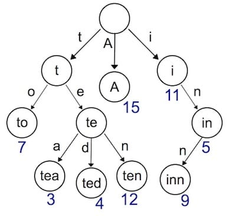
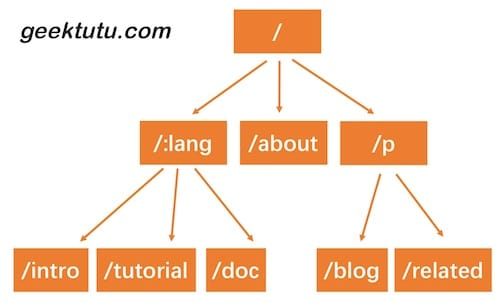

This is the third article of the [7 Days Go Web Framework Tutorial Series from scratch](https://geektutu.com/post/gee.html).

- Use a Trie tree to implement dynamic route parsing.
- Support two patterns, `:name` and `*filepath`, **about 150 lines of code**.

## Introduction to the Trie Tree

Previously, we used a very simple `map` structure to store the routing table. Storing key-value pairs in a `map` makes indexing very efficient, but there is a drawback: the key-value pair storage approach can only be used to index static routes. So what should we do if we want to support dynamic routes like `/hello/:name`? A dynamic route means that a single route rule can match a certain type of route rather than one fixed route. For example, `/hello/:name` can match `/hello/geektutu`, `hello/jack`, and so on.

There are many ways to implement dynamic routing, which differ greatly in the rules they support, their performance, and so on. For example, the open-source router implementation `gorouter` supports embedding regular expressions in route rules, such as `/p/[0-9A-Za-z]+`, meaning the parameter in the path only matches digits and letters; another open-source implementation, `httprouter`, does not support regular expressions. The famous open-source Web framework `gin`, in its early versions, did not implement its own routing but used `httprouter` directly. Later, for reasons unknown, it abandoned `httprouter` and implemented its own version.



The most commonly used data structure for implementing dynamic routing is called the prefix tree (Trie tree). From the name, you can probably get an idea of what a prefix tree looks like: all children of every node share the same prefix. This structure is very well suited for route matching. For example, suppose we define the following route rules:

- /:lang/doc
- /:lang/tutorial
- /:lang/intro
- /about
- /p/blog
- /p/related

Represented with a prefix tree, it looks like this.



The path of an HTTP request happens to consist of multiple segments separated by `/`. Therefore, each segment can serve as a node of the prefix tree. We query through the tree structure, and if none of the nodes at some intermediate level satisfy the condition, it means no route has been matched, and the query ends.

The dynamic routing we are going to implement next has the following two capabilities.

- Parameter matching `:`. For example, `/p/:lang/doc` can match `/p/c/doc` and `/p/go/doc`.
- Wildcard `*`. For example, `/static/*filepath` can match `/static/fav.ico`, as well as `/static/js/jQuery.js`. This pattern is often used for static servers and can match sub-paths recursively.

## Implementing the Trie Tree

First, we need to design what information should be stored on the tree nodes.

**[day3-router/gee/trie.go](https://github.com/geektutu/7days-golang/tree/master/gee-web/day3-router)**

```go
type node struct {
	pattern  string // route to be matched, e.g. /p/:lang
	part     string // a part of the route, e.g. :lang
	children []*node // children, e.g. [doc, tutorial, intro]
	isWild   bool // whether exact match, true when part contains : or *
}
```

Unlike an ordinary tree, we add the `isWild` parameter to implement dynamic route matching. That is, when we match the route `/p/go/doc/`, at the first level, `p` exactly matches `p`; at the second level, `go` fuzzily matches `:lang`, so the parameter `lang` will be assigned the value `go`, and matching continues to the next level. We wrap the matching logic into a helper function.

```go
// The first successfully matched node, used for insertion
func (n *node) matchChild(part string) *node {
	for _, child := range n.children {
		if child.part == part || child.isWild {
			return child
		}
	}
	return nil
}
// All successfully matched nodes, used for search
func (n *node) matchChildren(part string) []*node {
	nodes := make([]*node, 0)
	for _, child := range n.children {
		if child.part == part || child.isWild {
			nodes = append(nodes, child)
		}
	}
	return nodes
}
```

For routing, the most important things are naturally registration and matching. When developing a service, we register route rules and map handlers; when requests come in, we match route rules and find the corresponding handlers. Therefore, the Trie tree needs to support node insertion and search. Insertion is quite simple: recursively search the nodes at each level, and if no node matches the current `part`, create a new one. One thing to note: for `/p/:lang/doc`, only at the third-level node, i.e. the `doc` node, is `pattern` set to `/p/:lang/doc`. The `pattern` attributes of the `p` and `:lang` nodes are both empty. Therefore, when matching ends, we can use `n.pattern == ""` to determine whether the route rule has been matched successfully. For example, although `/p/python` successfully matches `:lang`, the `pattern` value of `:lang` is empty, so the match fails. Search likewise recursively queries the nodes at each level. The exit rules are: a `*` is matched, the match fails, or the `len(parts)`-th level node has been reached.

```go
func (n *node) insert(pattern string, parts []string, height int) {
	if len(parts) == height {
		n.pattern = pattern
		return
	}

	part := parts[height]
	child := n.matchChild(part)
	if child == nil {
		child = &node{part: part, isWild: part[0] == ':' || part[0] == '*'}
		n.children = append(n.children, child)
	}
	child.insert(pattern, parts, height+1)
}

func (n *node) search(parts []string, height int) *node {
	if len(parts) == height || strings.HasPrefix(n.part, "*") {
		if n.pattern == "" {
			return nil
		}
		return n
	}

	part := parts[height]
	children := n.matchChildren(part)

	for _, child := range children {
		result := child.search(parts, height+1)
		if result != nil {
			return result
		}
	}

	return nil
}
```

## Router

Now that both insertion and search of the Trie tree have been implemented successfully, let's apply the Trie tree to routing. We use roots to store the root node of the Trie tree for each request method, and handlers to store the HandlerFunc for each request method. In the getRoute function, the parameters of the two matchers `:` and `*` are also parsed and returned as a map. For example, `/p/go/doc` matches `/p/:lang/doc`, and the parsed result is `{lang: "go"}`; `/static/css/geektutu.css` matches `/static/*filepath`, and the parsed result is `{filepath: "css/geektutu.css"}`.

**day3-router/gee/router.go**

```go
type router struct {
	roots    map[string]*node
	handlers map[string]HandlerFunc
}

// roots key eg, roots['GET'] roots['POST']
// handlers key eg, handlers['GET-/p/:lang/doc'], handlers['POST-/p/book']
    
func newRouter() *router {
	return &router{
		roots:    make(map[string]*node),
		handlers: make(map[string]HandlerFunc),
	}
}

// Only one * is allowed
func parsePattern(pattern string) []string {
	vs := strings.Split(pattern, "/")

	parts := make([]string, 0)
	for _, item := range vs {
		if item != "" {
			parts = append(parts, item)
			if item[0] == '*' {
				break
			}
		}
	}
	return parts
}

func (r *router) addRoute(method string, pattern string, handler HandlerFunc) {
	parts := parsePattern(pattern)

	key := method + "-" + pattern
	_, ok := r.roots[method]
	if !ok {
		r.roots[method] = &node{}
	}
	r.roots[method].insert(pattern, parts, 0)
	r.handlers[key] = handler
}

func (r *router) getRoute(method string, path string) (*node, map[string]string) {
	searchParts := parsePattern(path)
	params := make(map[string]string)
	root, ok := r.roots[method]

	if !ok {
		return nil, nil
	}

	n := root.search(searchParts, 0)

	if n != nil {
		parts := parsePattern(n.pattern)
		for index, part := range parts {
			if part[0] == ':' {
				params[part[1:]] = searchParts[index]
			}
			if part[0] == '*' && len(part) > 1 {
				params[part[1:]] = strings.Join(searchParts[index:], "/")
				break
			}
		}
		return n, params
	}

	return nil, nil
}
```

## Changes to Context and handle

In HandlerFunc, we hope to be able to access the parsed parameters. Therefore, we need to add an attribute and a method to the Context object to provide access to the route parameters. We store the parsed parameters in `Params`, and retrieve the corresponding value via `c.Param("lang")`.

**day3-router/gee/context.go**

```go
type Context struct {
	// origin objects
	Writer http.ResponseWriter
	Req    *http.Request
	// request info
	Path   string
	Method string
	Params map[string]string
	// response info
	StatusCode int
}

func (c *Context) Param(key string) string {
	value, _ := c.Params[key]
	return value
}
```

**day3-router/gee/router.go**

```go
func (r *router) handle(c *Context) {
	n, params := r.getRoute(c.Method, c.Path)
	if n != nil {
		c.Params = params
		key := c.Method + "-" + n.pattern
		r.handlers[key](c)
	} else {
		c.String(http.StatusNotFound, "404 NOT FOUND: %s\n", c.Path)
	}
}
```

The changes in `router.go` are relatively small. The relatively important point is that, before calling the matched `handler`, the parsed route parameters are assigned to `c.Params`. In this way, the specific values can be accessed through the `Context` object inside the `handler`.

## Unit Tests

```go
func newTestRouter() *router {
	r := newRouter()
	r.addRoute("GET", "/", nil)
	r.addRoute("GET", "/hello/:name", nil)
	r.addRoute("GET", "/hello/b/c", nil)
	r.addRoute("GET", "/hi/:name", nil)
	r.addRoute("GET", "/assets/*filepath", nil)
	return r
}

func TestParsePattern(t *testing.T) {
	ok := reflect.DeepEqual(parsePattern("/p/:name"), []string{"p", ":name"})
	ok = ok && reflect.DeepEqual(parsePattern("/p/*"), []string{"p", "*"})
	ok = ok && reflect.DeepEqual(parsePattern("/p/*name/*"), []string{"p", "*name"})
	if !ok {
		t.Fatal("test parsePattern failed")
	}
}

func TestGetRoute(t *testing.T) {
	r := newTestRouter()
	n, ps := r.getRoute("GET", "/hello/geektutu")

	if n == nil {
		t.Fatal("nil shouldn't be returned")
	}

	if n.pattern != "/hello/:name" {
		t.Fatal("should match /hello/:name")
	}

	if ps["name"] != "geektutu" {
		t.Fatal("name should be equal to 'geektutu'")
	}

	fmt.Printf("matched path: %s, params['name']: %s\n", n.pattern, ps["name"])

}
```

## Demo

Let's take a look at an example of using the framework.

**day3-router/main.go**

```go
func main() {
	r := gee.New()
	r.GET("/", func(c *gee.Context) {
		c.HTML(http.StatusOK, "<h1>Hello Gee</h1>")
	})

	r.GET("/hello", func(c *gee.Context) {
		// expect /hello?name=geektutu
		c.String(http.StatusOK, "hello %s, you're at %s\n", c.Query("name"), c.Path)
	})

	r.GET("/hello/:name", func(c *gee.Context) {
		// expect /hello/geektutu
		c.String(http.StatusOK, "hello %s, you're at %s\n", c.Param("name"), c.Path)
	})

	r.GET("/assets/*filepath", func(c *gee.Context) {
		c.JSON(http.StatusOK, gee.H{"filepath": c.Param("filepath")})
	})

	r.Run(":9999")
}
```

Test the results with the `curl` tool.

```bash
$ curl "http://localhost:9999/hello/geektutu"
hello geektutu, you're at /hello/geektutu

$ curl "http://localhost:9999/assets/css/geektutu.css"
{"filepath":"css/geektutu.css"}
```
