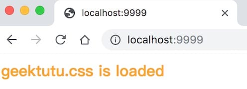

This is the sixth part of the [7 Days Go Web Framework Tutorial Series from scratch](https://geektutu.com/post/gee.html).

- Implement static resource serving (Static Resource).
- Support HTML template rendering.

## Server-Side Rendering

It is now increasingly popular to develop with the front end and back end separated, that is, the Web back end provides RESTful APIs that return structured data (usually JSON or XML), while the front end uses AJAX to fetch the required data and renders it with JavaScript. Front-end frameworks such as Vue/React keep gaining popularity. This model decouples the front end from the back end, and its advantages are prominent. Back-end developers can concentrate on resource utilization, concurrency, database problems, and so on, and only need to think about how the data is generated; front-end developers focus on interface design and implementation, and only need to think about how to render the data once they have it. Anyone who has built a website with JSP should have felt the pain of coupling the front end with the back end. The expressiveness of JSP is certainly far behind that of front-end rendering frameworks like Vue/React. Moreover, separating the front end from the back end has another advantage today that cannot be ignored. Since the back end only cares about data, and the API return values are structured and decoupled from the front end, the same back-end service can simultaneously support mini programs, mobile apps, PC web pages, and external APIs. With the continuous development of front-end engineering, tools like Webpack and gulp emerge one after another, and front-end technology is becoming more and more self-contained.

But one major problem with the separated model is that pages are rendered on the client, such as the browser, which is not crawler-friendly. The Google crawler is already able to crawl rendered pages, but in the short term, crawling HTML pages rendered directly on the server remains the mainstream.

Today's content is about how a Web framework can support server-side rendering.

## Serving Static Files

The three pillars of a web page are JavaScript, CSS, and HTML. To achieve server-side rendering, the first step is to support static files such as JS and CSS. Remember that when we designed dynamic routing, we supported the wildcard `*` to match multi-level sub-paths. For example, the route rule `/assets/*filepath` matches all addresses starting with `/assets/`. For `/assets/js/geektutu.js`, after matching, the parameter `filepath` is assigned the value `js/geektutu.js`.

So if we put all the static files under the `/usr/web` directory, the value of `filepath` is the relative path of the file within that directory. Once mapped to the real file, returning the file completes the static server.

As for how to return the file once it is found, the `net/http` library already implements that. Therefore, all the gee framework needs to do is parse the requested address, map it to the real path of the file on the server, and hand it over to `http.FileServer`.

[day6-template/gee/gee.go](https://github.com/geektutu/7days-golang/tree/master/gee-web/day6-template)

```go
// create static handler
func (group *RouterGroup) createStaticHandler(relativePath string, fs http.FileSystem) HandlerFunc {
	absolutePath := path.Join(group.prefix, relativePath)
	fileServer := http.StripPrefix(absolutePath, http.FileServer(fs))
	return func(c *Context) {
		file := c.Param("filepath")
		// Check if file exists and/or if we have permission to access it
		if _, err := fs.Open(file); err != nil {
			c.Status(http.StatusNotFound)
			return
		}

		fileServer.ServeHTTP(c.Writer, c.Req)
	}
}

// serve static files
func (group *RouterGroup) Static(relativePath string, root string) {
	handler := group.createStaticHandler(relativePath, http.Dir(root))
	urlPattern := path.Join(relativePath, "/*filepath")
	// Register GET handlers
	group.GET(urlPattern, handler)
}
```

We added 2 methods to `RouterGroup`; the `Static` method is exposed to users. Users can map a folder `root` on the disk to the route `relativePath`. For example:

```go
r := gee.New()
r.Static("/assets", "/usr/geektutu/blog/static")
// or with a relative path: r.Static("/assets", "./static")
r.Run(":9999")
```

When a user visits `localhost:9999/assets/js/geektutu.js`, the file `/usr/geektutu/blog/static/js/geektutu.js` is returned in the end.

## HTML Template Rendering

Go has two built-in template standard libraries, `text/template` and `html/template`, among which [html/template](https://golang.org/pkg/html/template/) provides fairly complete support for HTML, including rendering plain variables, lists, objects, and so on. The template rendering of the gee framework directly uses the capabilities provided by `html/template`.

```go
Engine struct {
	*RouterGroup
	router        *router
	groups        []*RouterGroup     // store all groups
	htmlTemplates *template.Template // for html render
	funcMap       template.FuncMap   // for html render
}

func (engine *Engine) SetFuncMap(funcMap template.FuncMap) {
	engine.funcMap = funcMap
}

func (engine *Engine) LoadHTMLGlob(pattern string) {
	engine.htmlTemplates = template.Must(template.New("").Funcs(engine.funcMap).ParseGlob(pattern))
}
```

First, we added `*template.Template` and `template.FuncMap` objects to the Engine instance: the former loads all templates into memory, and the latter holds all the custom template rendering functions.

In addition, users are provided with methods to set the custom rendering function `funcMap` and to load templates.

Next, we made a small modification to the original `(*Context).HTML()` method so that it supports selecting a template by file name for rendering.

[day6-template/gee/context.go](https://github.com/geektutu/7days-golang/tree/master/gee-web/day6-template)

```go
type Context struct {
    // ...
	// engine pointer
	engine *Engine
}

func (c *Context) HTML(code int, name string, data interface{}) {
	c.SetHeader("Content-Type", "text/html")
	c.Status(code)
	if err := c.engine.htmlTemplates.ExecuteTemplate(c.Writer, name, data); err != nil {
		c.Fail(500, err.Error())
	}
}
```

We added the member variable `engine *Engine` to the `Context`, so that the HTML templates in the Engine can be accessed through the Context. When instantiating the Context, we also need to assign a value to `c.engine`.

[day6-template/gee/gee.go](https://github.com/geektutu/7days-golang/tree/master/gee-web/day6-template)

```go
func (engine *Engine) ServeHTTP(w http.ResponseWriter, req *http.Request) {
	// ...
	c := newContext(w, req)
	c.handlers = middlewares
	c.engine = engine
	engine.router.handle(c)
}
```

## Usage Demo

The final directory structure:

```bash
---gee/
---static/
   |---css/
        |---geektutu.css
   |---file1.txt
---templates/
   |---arr.tmpl
   |---css.tmpl
   |---custom_func.tmpl
---main.go
```

```html
<!-- day6-template/templates/css.tmpl -->
<html>
    <link rel="stylesheet" href="/assets/css/geektutu.css">
    <p>geektutu.css is loaded</p>
</html>
```

[day6-template/main.go](https://github.com/geektutu/7days-golang/tree/master/gee-web/day6-template)

```go
type student struct {
	Name string
	Age  int8
}

func FormatAsDate(t time.Time) string {
	year, month, day := t.Date()
	return fmt.Sprintf("%d-%02d-%02d", year, month, day)
}

func main() {
	r := gee.New()
	r.Use(gee.Logger())
	r.SetFuncMap(template.FuncMap{
		"FormatAsDate": FormatAsDate,
	})
	r.LoadHTMLGlob("templates/*")
	r.Static("/assets", "./static")

	stu1 := &student{Name: "Geektutu", Age: 20}
	stu2 := &student{Name: "Jack", Age: 22}
	r.GET("/", func(c *gee.Context) {
		c.HTML(http.StatusOK, "css.tmpl", nil)
	})
	r.GET("/students", func(c *gee.Context) {
		c.HTML(http.StatusOK, "arr.tmpl", gee.H{
			"title":  "gee",
			"stuArr": [2]*student{stu1, stu2},
		})
	})

	r.GET("/date", func(c *gee.Context) {
		c.HTML(http.StatusOK, "custom_func.tmpl", gee.H{
			"title": "gee",
			"now":   time.Date(2019, 8, 17, 0, 0, 0, 0, time.UTC),
		})
	})

	r.Run(":9999")
}
```

Visit the home page: the template renders correctly, and the CSS static file is loaded successfully.


